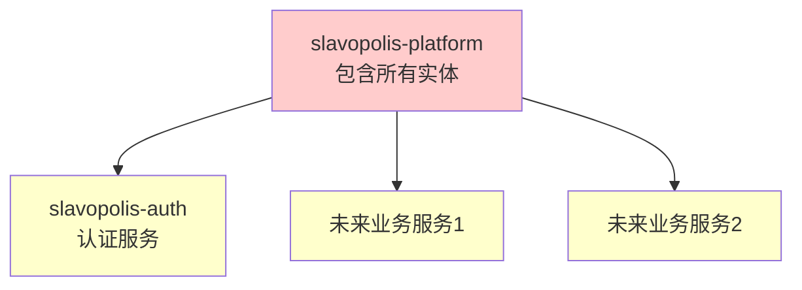
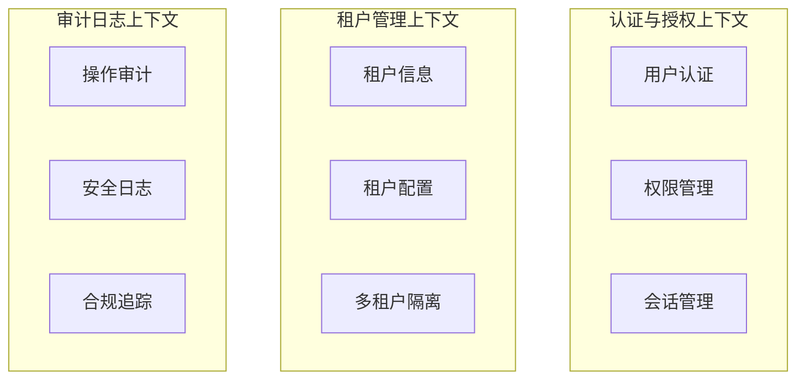
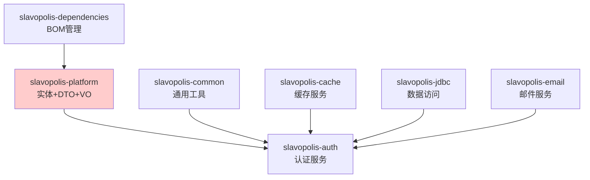
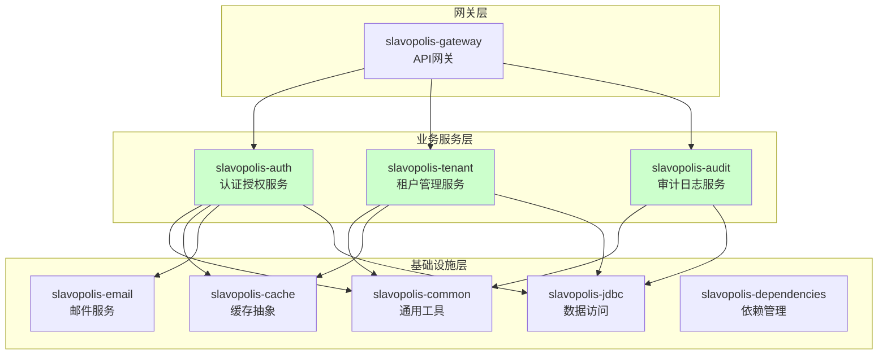
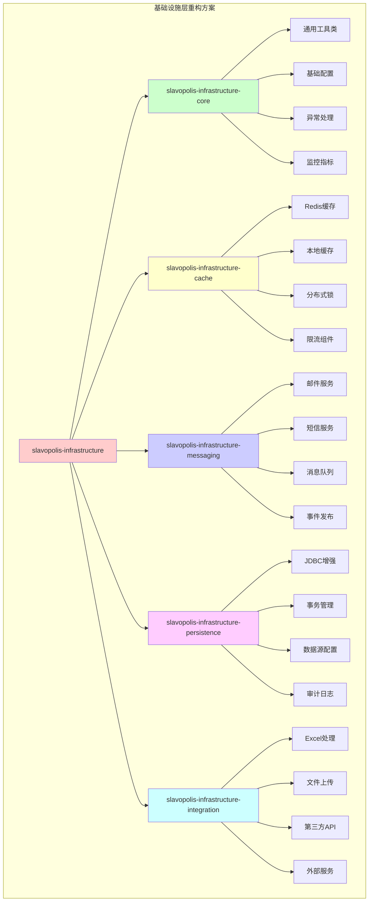
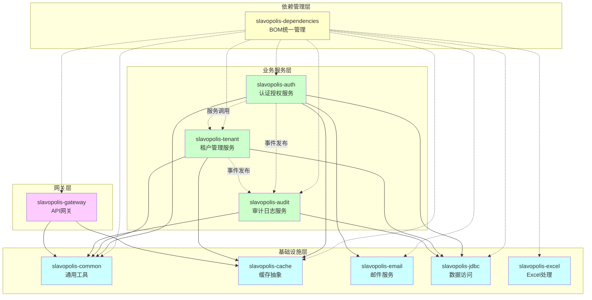

# Slavopolis Boot 微服务架构 DDD 重构方案

## 1. 当前架构问题分析

### 1.1 核心问题识别

经过深入分析当前项目结构，我们发现了以下严重违反微服务架构和DDD原则的问题：

#### 1.1.1 违反微服务独立性原则

**问题表现**：
- `slavopolis-platform` 模块包含所有实体类（SysUser、SysRole、SysPermission等）
- `slavopolis-auth` 模块依赖 `slavopolis-platform` 来获取实体类  
- 这种共享实体的方式违背了微服务独立性原则

**问题影响**：


这种架构导致：
- 微服务间紧耦合
- 无法独立部署和扩展
- 数据模型变更影响所有服务
- 技术栈无法自由选择

#### 1.1.2 缺乏清晰的限界上下文

**当前状况**：
- 所有实体混杂在一个模块中
- 没有明确的业务边界划分
- 缺乏统一语言的体现

**应该的边界**：


#### 1.1.3 不符合DDD分层架构

**当前层次结构问题**：
- 领域模型与基础设施混杂
- 没有明确的应用层和领域层分离
- 缺乏防腐层设计

### 1.2 具体技术债务

#### 1.2.1 依赖关系混乱



#### 1.2.2 职责边界不清

**slavopolis-platform 承担过多职责**：
- 实体定义
- DTO定义  
- VO定义
- 仓储接口
- 基础服务

**应该的职责分离**：
- 每个限界上下文拥有自己的领域模型
- 通用能力下沉到基础设施层
- 业务逻辑封装在各自的领域服务中

## 2. DDD重构目标架构

### 2.1 整体架构愿景

基于DDD和微服务最佳实践，重构后的架构应该实现：



### 2.2 限界上下文设计

#### 2.2.1 认证授权上下文 (slavopolis-auth)

**核心领域**：用户身份认证、权限管理、会话控制

**聚合根**：
- User聚合：用户信息、认证状态、登录历史
- Role聚合：角色定义、权限分配
- Permission聚合：权限资源、操作控制
- UserSession聚合：会话管理、安全控制

**领域服务**：
- AuthenticationService：认证逻辑
- AuthorizationService：授权逻辑
- PasswordService：密码策略
- TokenService：令牌管理

#### 2.2.2 租户管理上下文 (slavopolis-tenant)

**核心领域**：多租户隔离、租户配置、资源管理

**聚合根**：
- Tenant聚合：租户信息、配置项、状态管理

**领域服务**：
- TenantService：租户管理逻辑
- IsolationService：数据隔离逻辑

#### 2.2.3 审计日志上下文 (slavopolis-audit)

**核心领域**：操作审计、安全日志、合规追踪

**聚合根**：
- AuditLog聚合：审计记录、操作轨迹

**领域服务**：
- AuditService：审计逻辑
- ComplianceService：合规检查

### 2.3 基础设施模块重构设计

#### 2.3.1 基础设施模块重构背景

基于对现有代码结构的分析，发现基础设施模块存在以下问题：

1. **职责分散**：cache、email、jdbc、excel等基础设施模块独立存在，缺乏统一组织
2. **依赖混乱**：email模块依赖cache模块，违反了基础设施层平级原则
3. **配置重复**：每个模块都有独立的配置体系，缺乏统一性
4. **维护困难**：基础设施功能分散，难以统一升级和维护

#### 2.3.2 基础设施模块重构方案

**推荐方案**：统一基础设施模块



**重构后的基础设施结构**：

```
slavopolis-infrastructure/                     # 基础设施根模块
├── slavopolis-infrastructure-core/            # 核心基础设施
│   ├── src/main/java/
│   │   └── club/slavopolis/infrastructure/core/
│   │       ├── config/                        # 通用配置
│   │       ├── exception/                     # 异常处理
│   │       ├── util/                          # 工具类
│   │       ├── constant/                      # 常量定义
│   │       ├── monitor/                       # 监控指标
│   │       └── autoconfigure/                 # 自动配置
│   └── pom.xml
├── slavopolis-infrastructure-cache/           # 缓存基础设施
│   ├── src/main/java/
│   │   └── club/slavopolis/infrastructure/cache/
│   │       ├── redis/                         # Redis实现
│   │       ├── local/                         # 本地缓存
│   │       ├── lock/                          # 分布式锁
│   │       └── ratelimit/                     # 限流组件
│   └── pom.xml
├── slavopolis-infrastructure-messaging/       # 消息基础设施
│   ├── src/main/java/
│   │   └── club/slavopolis/infrastructure/messaging/
│   │       ├── email/                         # 邮件服务
│   │       ├── sms/                           # 短信服务
│   │       ├── mq/                            # 消息队列
│   │       └── event/                         # 事件发布
│   └── pom.xml
├── slavopolis-infrastructure-persistence/     # 持久化基础设施
│   ├── src/main/java/
│   │   └── club/slavopolis/infrastructure/persistence/
│   │       ├── jdbc/                          # JDBC增强
│   │       ├── transaction/                   # 事务管理
│   │       ├── datasource/                    # 数据源配置
│   │       └── audit/                         # 审计日志
│   └── pom.xml
├── slavopolis-infrastructure-integration/     # 集成基础设施
│   ├── src/main/java/
│   │   └── club/slavopolis/infrastructure/integration/
│   │       ├── excel/                         # Excel处理
│   │       ├── file/                          # 文件处理
│   │       ├── http/                          # HTTP客户端
│   │       └── external/                      # 外部服务
│   └── pom.xml
└── pom.xml                                    # 父POM
```

#### 2.3.3 完整项目重构后的目录结构

**整体项目结构概览**：

```
slavopolis-boot/
├── slavopolis-dependencies/                    # 依赖管理 BOM
├── slavopolis-infrastructure/                  # 统一基础设施模块
│   ├── slavopolis-infrastructure-core/        # 核心基础设施
│   ├── slavopolis-infrastructure-cache/       # 缓存基础设施
│   ├── slavopolis-infrastructure-messaging/   # 消息基础设施
│   ├── slavopolis-infrastructure-persistence/ # 持久化基础设施
│   └── slavopolis-infrastructure-integration/ # 集成基础设施
├── slavopolis-gateway/                         # API网关服务
├── slavopolis-auth/                            # 认证授权服务 (DDD分层)
├── slavopolis-tenant/                          # 租户管理服务 (DDD分层)
├── slavopolis-audit/                           # 审计日志服务 (DDD分层)
└── pom.xml                                     # 根POM
```

**基础设施模块职责划分**：

1. **slavopolis-infrastructure-core（核心基础设施）**
   - 提供所有基础设施模块的通用能力
   - 统一配置管理、异常处理、监控指标
   - 基础工具类和常量定义

2. **slavopolis-infrastructure-cache（缓存基础设施）**
   - 多级缓存（Redis + 本地缓存）
   - 分布式锁服务
   - 限流组件

3. **slavopolis-infrastructure-messaging（消息基础设施）**
   - 邮件发送服务（整合原slavopolis-email）
   - 短信发送服务
   - 消息队列支持
   - 领域事件发布

4. **slavopolis-infrastructure-persistence（持久化基础设施）**
   - JDBC增强功能（整合原slavopolis-jdbc）
   - 事务管理
   - 数据源配置
   - 审计日志

5. **slavopolis-infrastructure-integration（集成基础设施）**
   - Excel处理（整合原slavopolis-excel）
   - 文件上传下载
   - HTTP客户端
   - 第三方服务集成

#### 2.3.4 基础设施模块统一配置

**统一配置结构**：

```yaml
slavopolis:
  infrastructure:
    # 全局配置
    enabled: true
    key-prefix: slavopolis
    
    # 监控配置
    monitor:
      enabled: true
      metrics-enabled: true
      slow-operation-threshold: 1000ms
    
    # 安全配置
    security:
      encryption-enabled: true
      audit-enabled: true
    
    # 缓存配置
    cache:
      enabled: true
      default-expiration: PT1H
      providers:
        redis:
          enabled: true
          key-prefix: "cache:"
        local:
          enabled: true
          max-size: 10000
    
    # 消息配置
    messaging:
      enabled: true
      email:
        enabled: true
        default-sender: noreply@slavopolis.club
        template-path: classpath:templates/email/
      sms:
        enabled: false
        provider: aliyun
      event:
        enabled: true
        async: true
    
    # 持久化配置
    persistence:
      enabled: true
      jdbc:
        enhanced: true
        batch-size: 1000
        slow-query-threshold: 1000ms
      audit:
        enabled: true
        retention-days: 90
    
    # 集成配置
    integration:
      enabled: true
      excel:
        max-rows: 100000
        batch-size: 1000
        async-threshold: 10MB
      file:
        upload-path: /data/uploads
        max-size: 100MB
      http:
        connect-timeout: 5s
        read-timeout: 30s
```

#### 2.3.2 认证授权服务 (slavopolis-auth) 详细结构

```
slavopolis-auth/
├── auth-api/                           # 对外接口定义
│   ├── src/main/java/
│   │   └── club/slavopolis/auth/api/
│   │       ├── dto/                    # 数据传输对象
│   │       │   ├── request/           # 请求DTO
│   │       │   │   ├── UserLoginRequest.java
│   │       │   │   ├── UserRegisterRequest.java
│   │       │   │   ├── ChangePasswordRequest.java
│   │       │   │   ├── CreateRoleRequest.java
│   │       │   │   └── AssignRoleRequest.java
│   │       │   ├── response/          # 响应DTO
│   │       │   │   ├── AuthResponse.java
│   │       │   │   ├── UserInfoResponse.java
│   │       │   │   ├── RoleInfoResponse.java
│   │       │   │   └── PermissionInfoResponse.java
│   │       │   └── query/             # 查询DTO
│   │       │       ├── UserQueryDTO.java
│   │       │       └── RoleQueryDTO.java
│   │       ├── facade/                 # 外观接口
│   │       │   ├── AuthFacade.java
│   │       │   ├── UserFacade.java
│   │       │   └── RoleFacade.java
│   │       └── event/                  # 对外事件
│   │           ├── UserLoggedInEvent.java
│   │           ├── UserLoggedOutEvent.java
│   │           ├── UserCreatedEvent.java
│   │           └── PasswordChangedEvent.java
│   └── pom.xml
├── auth-domain/                        # 领域层
│   ├── src/main/java/
│   │   └── club/slavopolis/auth/domain/
│   │       ├── model/                  # 领域模型
│   │       │   ├── aggregate/          # 聚合根
│   │       │   │   ├── User.java
│   │       │   │   ├── Role.java
│   │       │   │   ├── Permission.java
│   │       │   │   └── UserSession.java
│   │       │   ├── entity/             # 实体
│   │       │   │   ├── LoginHistory.java
│   │       │   │   └── PasswordHistory.java
│   │       │   ├── valueobject/        # 值对象
│   │       │   │   ├── UserId.java
│   │       │   │   ├── RoleId.java
│   │       │   │   ├── PermissionId.java
│   │       │   │   ├── Email.java
│   │       │   │   ├── Username.java
│   │       │   │   ├── Password.java
│   │       │   │   ├── AuthToken.java
│   │       │   │   ├── UserStatus.java
│   │       │   │   └── SessionId.java
│   │       │   └── specification/      # 业务规格
│   │       │       ├── PasswordPolicy.java
│   │       │       └── UserRegistrationPolicy.java
│   │       ├── service/                # 领域服务
│   │       │   ├── AuthenticationService.java
│   │       │   ├── AuthorizationService.java
│   │       │   ├── PasswordService.java
│   │       │   ├── TokenService.java
│   │       │   └── SessionService.java
│   │       ├── repository/             # 仓储接口
│   │       │   ├── UserRepository.java
│   │       │   ├── RoleRepository.java
│   │       │   ├── PermissionRepository.java
│   │       │   └── UserSessionRepository.java
│   │       ├── event/                  # 领域事件
│   │       │   ├── UserCreatedEvent.java
│   │       │   ├── UserLoggedInEvent.java
│   │       │   ├── UserLoggedOutEvent.java
│   │       │   ├── PasswordChangedEvent.java
│   │       │   ├── RoleAssignedEvent.java
│   │       │   └── UserStatusChangedEvent.java
│   │       ├── factory/                # 工厂
│   │       │   ├── UserFactory.java
│   │       │   ├── RoleFactory.java
│   │       │   └── PermissionFactory.java
│   │       └── exception/              # 领域异常
│   │           ├── AuthenticationFailedException.java
│   │           ├── UserNotFoundException.java
│   │           ├── UserAlreadyExistsException.java
│   │           ├── InvalidPasswordException.java
│   │           └── AuthorizationException.java
│   └── pom.xml
├── auth-application/                   # 应用层
│   ├── src/main/java/
│   │   └── club/slavopolis/auth/application/
│   │       ├── service/                # 应用服务
│   │       │   ├── AuthApplicationService.java
│   │       │   ├── UserApplicationService.java
│   │       │   ├── RoleApplicationService.java
│   │       │   └── UserQueryService.java
│   │       ├── command/                # 命令对象
│   │       │   ├── LoginCommand.java
│   │       │   ├── LogoutCommand.java
│   │       │   ├── RegisterCommand.java
│   │       │   ├── ChangePasswordCommand.java
│   │       │   ├── CreateRoleCommand.java
│   │       │   └── AssignRoleCommand.java
│   │       ├── query/                  # 查询对象
│   │       │   ├── UserQuery.java
│   │       │   ├── RoleQuery.java
│   │       │   └── PermissionQuery.java
│   │       ├── handler/                # 命令处理器
│   │       │   ├── LoginHandler.java
│   │       │   ├── LogoutHandler.java
│   │       │   ├── RegisterHandler.java
│   │       │   ├── ChangePasswordHandler.java
│   │       │   ├── CreateRoleHandler.java
│   │       │   └── AssignRoleHandler.java
│   │       ├── assembler/              # 装配器
│   │       │   ├── UserAssembler.java
│   │       │   ├── RoleAssembler.java
│   │       │   └── PermissionAssembler.java
│   │       └── eventhandler/           # 事件处理器
│   │           ├── UserEventHandler.java
│   │           ├── AuditEventHandler.java
│   │           └── NotificationEventHandler.java
│   └── pom.xml
├── auth-infrastructure/                # 基础设施层
│   ├── src/main/java/
│   │   └── club/slavopolis/auth/infrastructure/
│   │       ├── persistence/            # 持久化
│   │       │   ├── po/                 # 持久化对象(PO)
│   │       │   │   ├── UserPO.java
│   │       │   │   ├── RolePO.java
│   │       │   │   ├── PermissionPO.java
│   │       │   │   ├── UserRolePO.java
│   │       │   │   ├── RolePermissionPO.java
│   │       │   │   ├── UserSessionPO.java
│   │       │   │   └── LoginHistoryPO.java
│   │       │   ├── repository/         # 仓储实现
│   │       │   │   ├── UserRepositoryImpl.java
│   │       │   │   ├── RoleRepositoryImpl.java
│   │       │   │   ├── PermissionRepositoryImpl.java
│   │       │   │   └── UserSessionRepositoryImpl.java
│   │       │   ├── dao/                # 数据访问对象
│   │       │   │   ├── UserDao.java
│   │       │   │   ├── RoleDao.java
│   │       │   │   ├── PermissionDao.java
│   │       │   │   └── UserSessionDao.java
│   │       │   └── converter/          # 领域对象转换器
│   │       │       ├── UserConverter.java
│   │       │       ├── RoleConverter.java
│   │       │       ├── PermissionConverter.java
│   │       │       └── UserSessionConverter.java
│   │       ├── messaging/              # 消息处理
│   │       │   ├── publisher/          # 事件发布
│   │       │   │   └── DomainEventPublisher.java
│   │       │   └── subscriber/         # 事件订阅
│   │       │       ├── TenantEventSubscriber.java
│   │       │       └── AuditEventSubscriber.java
│   │       ├── gateway/                # 外部服务网关
│   │       │   ├── TenantServiceGateway.java
│   │       │   └── AuditServiceGateway.java
│   │       ├── security/               # 安全配置
│   │       │   ├── SecurityConfig.java
│   │       │   ├── JwtTokenProvider.java
│   │       │   └── PasswordEncoder.java
│   │       └── config/                 # 配置类
│   │           ├── JdbcConfig.java
│   │           ├── RedisConfig.java
│   │           ├── MessageConfig.java
│   │           └── CacheConfig.java
│   └── pom.xml
├── auth-interface/                     # 接口层
│   ├── src/main/java/
│   │   └── club/slavopolis/auth/interfaces/
│   │       ├── rest/                   # REST接口
│   │       │   ├── AuthController.java
│   │       │   ├── UserController.java
│   │       │   ├── RoleController.java
│   │       │   └── PermissionController.java
│   │       ├── facade/                 # 外观实现
│   │       │   ├── AuthFacadeImpl.java
│   │       │   ├── UserFacadeImpl.java
│   │       │   └── RoleFacadeImpl.java
│   │       └── assembler/              # DTO装配器
│   │           ├── AuthDTOAssembler.java
│   │           ├── UserDTOAssembler.java
│   │           └── RoleDTOAssembler.java
│   └── pom.xml
├── auth-start/                         # 启动模块
│   ├── src/main/java/
│   │   └── club/slavopolis/auth/
│   │       └── AuthServiceApplication.java
│   ├── src/main/resources/
│   │   ├── application.yml
│   │   ├── application-dev.yml
│   │   ├── application-prod.yml
│   │   ├── bootstrap.yml
│   │   ├── banner.txt
│   │   └── db/migration/
│   │       ├── V1__Create_auth_tables.sql
│   │       └── V2__Insert_default_roles.sql
│   └── pom.xml
└── pom.xml                             # 父POM
```

#### 2.3.3 租户管理服务 (slavopolis-tenant) 详细结构

```
slavopolis-tenant/
├── tenant-api/                         # 对外接口定义
│   ├── src/main/java/
│   │   └── club/slavopolis/tenant/api/
│   │       ├── dto/                    # 数据传输对象
│   │       │   ├── request/           # 请求DTO
│   │       │   │   ├── CreateTenantRequest.java
│   │       │   │   ├── UpdateTenantRequest.java
│   │       │   │   └── TenantConfigRequest.java
│   │       │   ├── response/          # 响应DTO
│   │       │   │   ├── TenantInfoResponse.java
│   │       │   │   └── TenantConfigResponse.java
│   │       │   └── query/             # 查询DTO
│   │       │       └── TenantQueryDTO.java
│   │       ├── facade/                 # 外观接口
│   │       │   └── TenantFacade.java
│   │       └── event/                  # 对外事件
│   │           ├── TenantCreatedEvent.java
│   │           ├── TenantStatusChangedEvent.java
│   │           └── TenantConfigChangedEvent.java
│   └── pom.xml
├── tenant-domain/                      # 领域层
│   ├── src/main/java/
│   │   └── club/slavopolis/tenant/domain/
│   │       ├── model/                  # 领域模型
│   │       │   ├── aggregate/          # 聚合根
│   │       │   │   └── Tenant.java
│   │       │   ├── entity/             # 实体  
│   │       │   │   └── TenantConfig.java
│   │       │   ├── valueobject/        # 值对象
│   │       │   │   ├── TenantId.java
│   │       │   │   ├── TenantName.java
│   │       │   │   ├── TenantCode.java
│   │       │   │   ├── TenantStatus.java
│   │       │   │   └── ContactInfo.java
│   │       │   └── specification/      # 业务规格
│   │       │       └── TenantCreationPolicy.java
│   │       ├── service/                # 领域服务
│   │       │   ├── TenantService.java
│   │       │   └── IsolationService.java
│   │       ├── repository/             # 仓储接口
│   │       │   └── TenantRepository.java
│   │       ├── event/                  # 领域事件
│   │       │   ├── TenantCreatedEvent.java
│   │       │   ├── TenantStatusChangedEvent.java
│   │       │   └── TenantConfigChangedEvent.java
│   │       ├── factory/                # 工厂
│   │       │   └── TenantFactory.java
│   │       └── exception/              # 领域异常
│   │           ├── TenantNotFoundException.java
│   │           ├── TenantAlreadyExistsException.java
│   │           └── TenantNotActiveException.java
│   └── pom.xml
├── tenant-application/                 # 应用层
│   ├── src/main/java/
│   │   └── club/slavopolis/tenant/application/
│   │       ├── service/                # 应用服务
│   │       │   ├── TenantApplicationService.java
│   │       │   └── TenantQueryService.java
│   │       ├── command/                # 命令对象
│   │       │   ├── CreateTenantCommand.java
│   │       │   ├── UpdateTenantCommand.java
│   │       │   └── ChangeTenantStatusCommand.java
│   │       ├── query/                  # 查询对象
│   │       │   └── TenantQuery.java
│   │       ├── handler/                # 命令处理器
│   │       │   ├── CreateTenantHandler.java
│   │       │   ├── UpdateTenantHandler.java
│   │       │   └── ChangeTenantStatusHandler.java
│   │       ├── assembler/              # 装配器
│   │       │   └── TenantAssembler.java
│   │       └── eventhandler/           # 事件处理器
│   │           └── TenantEventHandler.java
│   └── pom.xml
├── tenant-infrastructure/              # 基础设施层
│   ├── src/main/java/
│   │   └── club/slavopolis/tenant/infrastructure/
│   │       ├── persistence/            # 持久化
│   │       │   ├── po/                 # 持久化对象(PO)
│   │       │   │   ├── TenantPO.java
│   │       │   │   └── TenantConfigPO.java
│   │       │   ├── repository/         # 仓储实现
│   │       │   │   └── TenantRepositoryImpl.java
│   │       │   ├── dao/                # 数据访问对象
│   │       │   │   └── TenantDao.java
│   │       │   └── converter/          # 领域对象转换器
│   │       │       └── TenantConverter.java
│   │       ├── messaging/              # 消息处理
│   │       │   ├── publisher/          # 事件发布
│   │       │   │   └── DomainEventPublisher.java
│   │       │   └── subscriber/         # 事件订阅
│   │       │       └── AuthEventSubscriber.java
│   │       ├── gateway/                # 外部服务网关
│   │       │   └── AuthServiceGateway.java
│   │       └── config/                 # 配置类
│   │           ├── JdbcConfig.java
│   │           └── MessageConfig.java
│   └── pom.xml
├── tenant-interface/                   # 接口层
│   ├── src/main/java/
│   │   └── club/slavopolis/tenant/interfaces/
│   │       ├── rest/                   # REST接口
│   │       │   └── TenantController.java
│   │       ├── facade/                 # 外观实现
│   │       │   └── TenantFacadeImpl.java
│   │       └── assembler/              # DTO装配器
│   │           └── TenantDTOAssembler.java
│   └── pom.xml
├── tenant-start/                       # 启动模块
│   ├── src/main/java/
│   │   └── club/slavopolis/tenant/
│   │       └── TenantServiceApplication.java
│   ├── src/main/resources/
│   │   ├── application.yml
│   │   ├── application-dev.yml
│   │   ├── application-prod.yml
│   │   ├── bootstrap.yml
│   │   ├── banner.txt
│   │   └── db/migration/
│   │       └── V1__Create_tenant_tables.sql
│   └── pom.xml
└── pom.xml                             # 父POM
```

#### 2.3.4 审计日志服务 (slavopolis-audit) 详细结构

```
slavopolis-audit/
├── audit-api/                          # 对外接口定义
│   ├── src/main/java/
│   │   └── club/slavopolis/audit/api/
│   │       ├── dto/                    # 数据传输对象
│   │       │   ├── request/           # 请求DTO
│   │       │   │   └── CreateAuditLogRequest.java
│   │       │   ├── response/          # 响应DTO
│   │       │   │   └── AuditLogResponse.java
│   │       │   └── query/             # 查询DTO
│   │       │       └── AuditLogQueryDTO.java
│   │       ├── facade/                 # 外观接口
│   │       │   └── AuditFacade.java
│   │       └── event/                  # 对外事件
│   │           └── AuditLogCreatedEvent.java
│   └── pom.xml
├── audit-domain/                       # 领域层
│   ├── src/main/java/
│   │   └── club/slavopolis/audit/domain/
│   │       ├── model/                  # 领域模型
│   │       │   ├── aggregate/          # 聚合根
│   │       │   │   └── AuditLog.java
│   │       │   ├── valueobject/        # 值对象
│   │       │   │   ├── AuditLogId.java
│   │       │   │   ├── OperationType.java
│   │       │   │   ├── ResourceType.java
│   │       │   │   ├── OperationResult.java
│   │       │   │   └── AuditContext.java
│   │       │   └── specification/      # 业务规格
│   │       │       └── AuditRetentionPolicy.java
│   │       ├── service/                # 领域服务
│   │       │   ├── AuditService.java
│   │       │   └── ComplianceService.java
│   │       ├── repository/             # 仓储接口
│   │       │   └── AuditLogRepository.java
│   │       ├── event/                  # 领域事件
│   │       │   └── AuditLogCreatedEvent.java
│   │       ├── factory/                # 工厂
│   │       │   └── AuditLogFactory.java
│   │       └── exception/              # 领域异常
│   │           └── AuditLogException.java
│   └── pom.xml
├── audit-application/                  # 应用层
│   ├── src/main/java/
│   │   └── club/slavopolis/audit/application/
│   │       ├── service/                # 应用服务
│   │       │   ├── AuditApplicationService.java
│   │       │   └── AuditQueryService.java
│   │       ├── command/                # 命令对象
│   │       │   └── CreateAuditLogCommand.java
│   │       ├── query/                  # 查询对象
│   │       │   └── AuditLogQuery.java
│   │       ├── handler/                # 命令处理器
│   │       │   └── CreateAuditLogHandler.java
│   │       ├── assembler/              # 装配器
│   │       │   └── AuditLogAssembler.java
│   │       └── eventhandler/           # 事件处理器
│   │           ├── UserEventHandler.java
│   │           ├── TenantEventHandler.java
│   │           └── SystemEventHandler.java
│   └── pom.xml
├── audit-infrastructure/               # 基础设施层
│   ├── src/main/java/
│   │   └── club/slavopolis/audit/infrastructure/
│   │       ├── persistence/            # 持久化
│   │       │   ├── po/                 # 持久化对象(PO)
│   │       │   │   └── AuditLogPO.java
│   │       │   ├── repository/         # 仓储实现
│   │       │   │   └── AuditLogRepositoryImpl.java
│   │       │   ├── dao/                # 数据访问对象
│   │       │   │   └── AuditLogDao.java
│   │       │   └── converter/          # 领域对象转换器
│   │       │       └── AuditLogConverter.java
│   │       ├── messaging/              # 消息处理
│   │       │   └── subscriber/         # 事件订阅
│   │       │       ├── AuthEventSubscriber.java
│   │       │       ├── TenantEventSubscriber.java
│   │       │       └── SystemEventSubscriber.java
│   │       └── config/                 # 配置类
│   │           ├── JdbcConfig.java
│   │           └── MessageConfig.java
│   └── pom.xml
├── audit-interface/                    # 接口层
│   ├── src/main/java/
│   │   └── club/slavopolis/audit/interfaces/
│   │       ├── rest/                   # REST接口
│   │       │   └── AuditController.java
│   │       ├── facade/                 # 外观实现
│   │       │   └── AuditFacadeImpl.java
│   │       └── assembler/              # DTO装配器
│   │           └── AuditDTOAssembler.java
│   └── pom.xml
├── audit-start/                        # 启动模块
│   ├── src/main/java/
│   │   └── club/slavopolis/audit/
│   │       └── AuditServiceApplication.java
│   ├── src/main/resources/
│   │   ├── application.yml
│   │   ├── application-dev.yml
│   │   ├── application-prod.yml
│   │   ├── bootstrap.yml
│   │   ├── banner.txt
│   │   └── db/migration/
│   │       └── V1__Create_audit_tables.sql
│   └── pom.xml
└── pom.xml                             # 父POM
```

#### 2.3.5 API网关服务 (slavopolis-gateway) 详细结构

```
slavopolis-gateway/
├── src/main/java/
│   └── club/slavopolis/gateway/
│       ├── GatewayServiceApplication.java      # 启动类
│       ├── config/                             # 配置类
│       │   ├── GatewayConfig.java
│       │   ├── CorsConfig.java
│       │   ├── RedisConfig.java
│       │   └── SecurityConfig.java
│       ├── filter/                             # 网关过滤器
│       │   ├── AuthenticationFilter.java
│       │   ├── AuthorizationFilter.java
│       │   ├── RateLimitFilter.java
│       │   ├── LoggingFilter.java
│       │   └── TenantContextFilter.java
│       ├── handler/                            # 处理器
│       │   ├── GlobalExceptionHandler.java
│       │   └── FallbackHandler.java
│       ├── service/                            # 网关服务
│       │   ├── RouteService.java
│       │   └── LoadBalancerService.java
│       └── util/                               # 工具类
│           ├── JwtUtil.java
│           └── ResponseUtil.java
├── src/main/resources/
│   ├── application.yml                         # 主配置
│   ├── application-dev.yml                     # 开发环境
│   ├── application-prod.yml                    # 生产环境
│   ├── bootstrap.yml                           # 引导配置
│   └── banner.txt                              # 启动横幅
└── pom.xml                                     # Maven配置
```

#### 2.3.5 基础设施模块迁移策略

**迁移原则**：
1. **渐进式迁移**：不需要一次性重构，可以分阶段进行
2. **保持向后兼容**：在迁移过程中保持现有API的兼容性
3. **统一接口设计**：新的基础设施模块提供统一的接口规范
4. **配置集中管理**：所有基础设施配置统一到infrastructure配置下

**具体迁移映射**：

| 原模块 | 新模块 | 迁移内容 |
|--------|--------|----------|
| slavopolis-cache | slavopolis-infrastructure-cache | 缓存服务、分布式锁、限流 |
| slavopolis-email | slavopolis-infrastructure-messaging | 邮件服务整合到消息基础设施 |
| slavopolis-jdbc | slavopolis-infrastructure-persistence | JDBC增强功能 |
| slavopolis-excel | slavopolis-infrastructure-integration | Excel处理功能 |
| slavopolis-common | 保留并增强 | 增加DDD基础类和统一工具 |

**slavopolis-common 增强结构**：
```
slavopolis-common/
├── src/main/java/
│   └── club/slavopolis/common/
│       ├── core/                               # 核心工具
│       │   ├── result/                         # 统一返回结果
│       │   │   ├── Result.java
│       │   │   ├── ResultCode.java
│       │   │   └── PageResult.java
│       │   ├── exception/                      # 通用异常
│       │   │   ├── BaseException.java
│       │   │   ├── BusinessException.java
│       │   │   ├── SystemException.java
│       │   │   └── ValidationException.java
│       │   ├── constants/                      # 通用常量
│       │   │   ├── CommonConstants.java
│       │   │   └── RegexConstants.java
│       │   └── util/                          # 通用工具类
│       │       ├── IdGenerator.java
│       │       ├── DateTimeUtil.java
│       │       ├── JsonUtil.java
│       │       ├── StringUtil.java
│       │       └── ValidationUtil.java
│       ├── domain/                            # 领域基础类
│       │   ├── base/                          # 基础领域类
│       │   │   ├── AggregateRoot.java
│       │   │   ├── Entity.java
│       │   │   ├── ValueObject.java
│       │   │   └── DomainEvent.java
│       │   ├── specification/                 # 规格模式基础
│       │   │   ├── Specification.java
│       │   │   └── CompositeSpecification.java
│       │   └── repository/                    # 仓储基础
│       │       └── BaseRepository.java
│       ├── web/                               # Web层工具
│       │   ├── interceptor/                   # 拦截器
│       │   │   ├── TenantInterceptor.java
│       │   │   └── LoggingInterceptor.java
│       │   ├── handler/                       # 处理器
│       │   │   └── GlobalExceptionHandler.java
│       │   └── util/                          # Web工具
│       │       ├── RequestUtil.java
│       │       └── ResponseUtil.java
│       └── security/                          # 安全工具
│           ├── util/                          # 安全工具类
│           │   ├── EncryptUtil.java
│           │   ├── HashUtil.java
│           │   └── SecurityUtil.java
│           └── context/                       # 安全上下文
│               ├── SecurityContext.java
│               └── TenantContext.java
└── pom.xml
```

## 3. 重构实施方案

### 3.1 重构阶段规划

#### 阶段一：基础架构重构 (2-3周)

**主要任务**：
1. 重构基础设施模块，建立统一的基础设施层
2. 重构项目结构，建立DDD分层架构
3. 拆分 `slavopolis-platform` 模块
4. 建立各限界上下文的基础结构

**具体步骤**：

1. **重构基础设施模块**
```bash
# 创建统一基础设施结构
mkdir -p slavopolis-infrastructure/{slavopolis-infrastructure-core,slavopolis-infrastructure-cache,slavopolis-infrastructure-messaging,slavopolis-infrastructure-persistence,slavopolis-infrastructure-integration}

# 创建各基础设施子模块的目录结构
mkdir -p slavopolis-infrastructure/slavopolis-infrastructure-core/src/main/java/club/slavopolis/infrastructure/core/{config,exception,util,constant,monitor,autoconfigure}
mkdir -p slavopolis-infrastructure/slavopolis-infrastructure-cache/src/main/java/club/slavopolis/infrastructure/cache/{redis,local,lock,ratelimit}
mkdir -p slavopolis-infrastructure/slavopolis-infrastructure-messaging/src/main/java/club/slavopolis/infrastructure/messaging/{email,sms,mq,event}
mkdir -p slavopolis-infrastructure/slavopolis-infrastructure-persistence/src/main/java/club/slavopolis/infrastructure/persistence/{jdbc,transaction,datasource,audit}
mkdir -p slavopolis-infrastructure/slavopolis-infrastructure-integration/src/main/java/club/slavopolis/infrastructure/integration/{excel,file,http,external}

# 迁移现有基础设施功能
# 将slavopolis-cache内容迁移到slavopolis-infrastructure-cache
# 将slavopolis-email内容迁移到slavopolis-infrastructure-messaging/email
# 将slavopolis-jdbc内容迁移到slavopolis-infrastructure-persistence/jdbc
# 将slavopolis-excel内容迁移到slavopolis-infrastructure-integration/excel
```

2. **创建认证服务DDD结构**
```bash
# 创建认证服务的DDD分层模块
mkdir -p slavopolis-auth/auth-api/src/main/java/club/slavopolis/auth/api/{dto,facade,event}
mkdir -p slavopolis-auth/auth-domain/src/main/java/club/slavopolis/auth/domain/{model/{aggregate,entity,valueobject,specification},service,repository,event,factory}
mkdir -p slavopolis-auth/auth-application/src/main/java/club/slavopolis/auth/application/{service,command,handler,assembler,eventhandler}
mkdir -p slavopolis-auth/auth-infrastructure/src/main/java/club/slavopolis/auth/infrastructure/{persistence/{entity,repository,converter},messaging/{publisher,subscriber},gateway,config}
mkdir -p slavopolis-auth/auth-interface/src/main/java/club/slavopolis/auth/interfaces/{rest,facade,assembler}
mkdir -p slavopolis-auth/auth-start/src/main/java/club/slavopolis/auth
```

3. **迁移实体到对应的领域层**
- 将 `SysUser` 重构为 `User` 聚合根，放入 `auth-domain/model/aggregate/`
- 将 `SysRole` 重构为 `Role` 聚合根
- 将 `SysPermission` 重构为 `Permission` 聚合根
- 将 `SysUserSession` 重构为 `UserSession` 聚合根

4. **建立基础设施层**
- 创建持久化对象(PO)在 `auth-infrastructure/persistence/po/`
- 创建数据访问对象(DAO)在 `auth-infrastructure/persistence/dao/`
- 实现仓储接口在 `auth-infrastructure/persistence/repository/`
- 建立领域对象转换器在 `auth-infrastructure/persistence/converter/`

5. **更新依赖关系**
- 更新根POM，添加slavopolis-infrastructure模块
- 移除原有的独立基础设施模块依赖
- 更新业务服务的依赖配置

#### 阶段二：领域模型重构 (2-3周)

**主要任务**：
1. 重构领域模型，实现富血模型
2. 建立领域服务
3. 实现聚合根业务逻辑

**核心领域模型设计**：

```java
// 用户聚合根
@Aggregate
public class User {
    private UserId userId;
    private Email email;
    private Username username;
    private Password password;
    private UserStatus status;
    private List<Role> roles;
    private LoginHistory loginHistory;
    
    // 业务行为
    public void authenticate(String rawPassword) {
        if (!password.matches(rawPassword)) {
            throw new AuthenticationFailedException("用户名或密码错误");
        }
        
        if (!status.isActive()) {
            throw new UserNotActiveException("用户账号已被禁用");
        }
        
        // 记录登录历史
        this.loginHistory.recordLogin(LocalDateTime.now());
        
        // 发布领域事件
        DomainEventPublisher.instance().publish(
            new UserLoggedInEvent(this.userId, this.email, LocalDateTime.now())
        );
    }
    
    public void changePassword(String oldPassword, String newPassword) {
        if (!password.matches(oldPassword)) {
            throw new InvalidPasswordException("原密码错误");
        }
        
        Password newPasswordVO = Password.create(newPassword);
        if (!PasswordPolicy.isValid(newPasswordVO)) {
            throw new PasswordPolicyViolationException("密码不符合安全策略");
        }
        
        this.password = newPasswordVO;
        
        // 发布密码变更事件
        DomainEventPublisher.instance().publish(
            new PasswordChangedEvent(this.userId, LocalDateTime.now())
        );
    }
    
    public void assignRole(Role role) {
        if (this.roles.contains(role)) {
            throw new RoleAlreadyAssignedException("用户已拥有此角色");
        }
        
        this.roles.add(role);
        
        // 发布角色分配事件
        DomainEventPublisher.instance().publish(
            new RoleAssignedEvent(this.userId, role.getRoleId(), LocalDateTime.now())
        );
    }
    
    public boolean hasPermission(String resource, String operation) {
        return roles.stream()
            .flatMap(role -> role.getPermissions().stream())
            .anyMatch(permission -> permission.allows(resource, operation));
    }
}
```

#### 阶段三：应用层重构 (1-2周)

**主要任务**：
1. 实现应用服务
2. 建立命令处理器
3. 实现DTO转换器

**应用服务示例**：

```java
@Service
@Transactional
public class AuthApplicationService {
    
    private final UserRepository userRepository;
    private final AuthenticationService authenticationService;
    private final TokenService tokenService;
    private final UserFactory userFactory;
    
    public AuthResponseDTO login(LoginCommand command) {
        // 验证命令
        validateLoginCommand(command);
        
        // 查找用户
        User user = userRepository.findByEmail(new Email(command.getEmail()));
        if (user == null) {
            throw new UserNotFoundException("用户不存在");
        }
        
        // 执行认证
        user.authenticate(command.getPassword());
        
        // 生成令牌
        AuthToken token = tokenService.generateToken(user);
        
        // 保存用户状态
        userRepository.save(user);
        
        // 返回结果
        return AuthResponseDTO.builder()
            .token(token.getValue())
            .expiresIn(token.getExpiresIn())
            .userInfo(convertToUserInfo(user))
            .build();
    }
    
    public void register(RegisterCommand command) {
        // 验证命令
        validateRegisterCommand(command);
        
        // 检查用户是否已存在
        if (userRepository.existsByEmail(new Email(command.getEmail()))) {
            throw new UserAlreadyExistsException("用户已存在");
        }
        
        // 创建用户
        User user = userFactory.createUser(
            new Email(command.getEmail()),
            new Username(command.getUsername()),
            Password.create(command.getPassword())
        );
        
        // 保存用户
        userRepository.save(user);
    }
}
```

#### 阶段四：基础设施层重构 (1-2周)

**主要任务**：
1. 实现仓储接口
2. 建立事件发布机制
3. 实现外部服务网关

#### 阶段五：接口层重构 (1周)

**主要任务**：
1. 重构REST控制器
2. 实现外观模式
3. 建立API文档

### 3.2 依赖关系与POM配置详解

#### 3.2.1 完整依赖关系图



#### 3.2.2 根POM文件配置

**pom.xml (根目录)**：
```xml
<?xml version="1.0" encoding="UTF-8"?>
<project xmlns="http://maven.apache.org/POM/4.0.0" 
         xmlns:xsi="http://www.w3.org/2001/XMLSchema-instance"
         xsi:schemaLocation="http://maven.apache.org/POM/4.0.0 
         https://maven.apache.org/xsd/maven-4.0.0.xsd">
    <modelVersion>4.0.0</modelVersion>

    <groupId>club.slavopolis</groupId>
    <artifactId>slavopolis-boot</artifactId>
    <version>1.0.0-SNAPSHOT</version>
    <packaging>pom</packaging>

    <name>Slavopolis Boot</name>
    <description>Slavopolis Boot 微服务基础框架 - 基于DDD的企业级微服务架构</description>

    <modules>
        <!-- 依赖管理 -->
        <module>slavopolis-dependencies</module>
        
        <!-- 基础设施模块 -->
        <module>slavopolis-common</module>
        <module>slavopolis-infrastructure</module>
        
        <!-- 网关服务 -->
        <module>slavopolis-gateway</module>
        
        <!-- 业务服务 -->
        <module>slavopolis-auth</module>
        <module>slavopolis-tenant</module>
        <module>slavopolis-audit</module>
    </modules>

    <properties>
        <!-- 基础编译配置 -->
        <java.version>21</java.version>
        <maven.compiler.source>21</maven.compiler.source>
        <maven.compiler.target>21</maven.compiler.target>
        <project.build.sourceEncoding>UTF-8</project.build.sourceEncoding>
        <project.reporting.outputEncoding>UTF-8</project.reporting.outputEncoding>
        
        <!-- 跳过测试标识 -->
        <maven.test.skip>false</maven.test.skip>
        <skipTests>false</skipTests>
    </properties>

    <dependencyManagement>
        <dependencies>
            <!-- Slavopolis Dependencies BOM - 统一依赖管理 -->
            <dependency>
                <groupId>club.slavopolis</groupId>
                <artifactId>slavopolis-dependencies</artifactId>
                <version>${project.version}</version>
                <type>pom</type>
                <scope>import</scope>
            </dependency>
        </dependencies>
    </dependencyManagement>

    <!-- 所有子模块共同依赖 -->
    <dependencies>
        <!-- 代码简化工具 - 所有模块都需要 -->
        <dependency>
            <groupId>org.projectlombok</groupId>
            <artifactId>lombok</artifactId>
            <scope>provided</scope>
        </dependency>
    </dependencies>

    <build>
        <plugins>
            <!-- Maven 编译插件 -->
            <plugin>
                <groupId>org.apache.maven.plugins</groupId>
                <artifactId>maven-compiler-plugin</artifactId>
                <version>3.11.0</version>
                <configuration>
                    <source>${maven.compiler.source}</source>
                    <target>${maven.compiler.target}</target>
                    <encoding>${project.build.sourceEncoding}</encoding>
                    <parameters>true</parameters>
                    <annotationProcessorPaths>
                        <path>
                            <groupId>org.projectlombok</groupId>
                            <artifactId>lombok</artifactId>
                            <version>${lombok.version}</version>
                        </path>
                    </annotationProcessorPaths>
                </configuration>
            </plugin>

            <!-- Spring Boot Maven 插件 -->
            <plugin>
                <groupId>org.springframework.boot</groupId>
                <artifactId>spring-boot-maven-plugin</artifactId>
                <version>${spring-boot.version}</version>
                <configuration>
                    <skip>true</skip>
                    <excludes>
                        <exclude>
                            <groupId>org.projectlombok</groupId>
                            <artifactId>lombok</artifactId>
                        </exclude>
                    </excludes>
                </configuration>
            </plugin>

            <!-- 单元测试插件 -->
            <plugin>
                <groupId>org.apache.maven.plugins</groupId>
                <artifactId>maven-surefire-plugin</artifactId>
                <version>3.0.0</version>
                <configuration>
                    <skipTests>${skipTests}</skipTests>
                    <includes>
                        <include>**/*Test.java</include>
                        <include>**/*Tests.java</include>
                    </includes>
                </configuration>
            </plugin>
        </plugins>
    </build>
</project>
```

#### 3.2.3 认证服务POM文件配置

**slavopolis-auth/pom.xml (父POM)**：
```xml
<?xml version="1.0" encoding="UTF-8"?>
<project xmlns="http://maven.apache.org/POM/4.0.0"
         xmlns:xsi="http://www.w3.org/2001/XMLSchema-instance"
         xsi:schemaLocation="http://maven.apache.org/POM/4.0.0 
         https://maven.apache.org/xsd/maven-4.0.0.xsd">
    <modelVersion>4.0.0</modelVersion>

    <parent>
        <groupId>club.slavopolis</groupId>
        <artifactId>slavopolis-boot</artifactId>
        <version>1.0.0-SNAPSHOT</version>
    </parent>

    <artifactId>slavopolis-auth</artifactId>
    <packaging>pom</packaging>

    <name>Slavopolis Auth Service</name>
    <description>认证授权服务 - 基于DDD的用户身份认证与权限管理</description>

    <modules>
        <module>auth-api</module>
        <module>auth-domain</module>
        <module>auth-application</module>
        <module>auth-infrastructure</module>
        <module>auth-interface</module>
        <module>auth-start</module>
    </modules>

    <dependencies>
        <!-- 通用工具依赖 -->
        <dependency>
            <groupId>club.slavopolis</groupId>
            <artifactId>slavopolis-common</artifactId>
        </dependency>
    </dependencies>
</project>
```

**slavopolis-auth/auth-domain/pom.xml (领域层)**：
```xml
<?xml version="1.0" encoding="UTF-8"?>
<project xmlns="http://maven.apache.org/POM/4.0.0"
         xmlns:xsi="http://www.w3.org/2001/XMLSchema-instance"
         xsi:schemaLocation="http://maven.apache.org/POM/4.0.0 
         https://maven.apache.org/xsd/maven-4.0.0.xsd">
    <modelVersion>4.0.0</modelVersion>

    <parent>
        <groupId>club.slavopolis</groupId>
        <artifactId>slavopolis-auth</artifactId>
        <version>1.0.0-SNAPSHOT</version>
    </parent>

    <artifactId>auth-domain</artifactId>

    <name>Auth Domain</name>
    <description>认证服务领域层 - 包含聚合根、实体、值对象、领域服务等</description>

    <dependencies>
        <!-- 只依赖通用工具，不依赖其他基础设施 -->
        <dependency>
            <groupId>club.slavopolis</groupId>
            <artifactId>slavopolis-common</artifactId>
        </dependency>
        
        <!-- Spring Boot Starter (仅用于依赖注入) -->
        <dependency>
            <groupId>org.springframework.boot</groupId>
            <artifactId>spring-boot-starter</artifactId>
        </dependency>
        
        <!-- 数据验证 -->
        <dependency>
            <groupId>org.springframework.boot</groupId>
            <artifactId>spring-boot-starter-validation</artifactId>
        </dependency>
    </dependencies>
</project>
```

**slavopolis-auth/auth-infrastructure/pom.xml (基础设施层)**：
```xml
<?xml version="1.0" encoding="UTF-8"?>
<project xmlns="http://maven.apache.org/POM/4.0.0"
         xmlns:xsi="http://www.w3.org/2001/XMLSchema-instance"
         xsi:schemaLocation="http://maven.apache.org/POM/4.0.0 
         https://maven.apache.org/xsd/maven-4.0.0.xsd">
    <modelVersion>4.0.0</modelVersion>

    <parent>
        <groupId>club.slavopolis</groupId>
        <artifactId>slavopolis-auth</artifactId>
        <version>1.0.0-SNAPSHOT</version>
    </parent>

    <artifactId>auth-infrastructure</artifactId>

    <name>Auth Infrastructure</name>
    <description>认证服务基础设施层 - 数据持久化、消息发布、外部服务集成</description>

    <dependencies>
        <!-- 依赖本服务的领域层 -->
        <dependency>
            <groupId>club.slavopolis</groupId>
            <artifactId>auth-domain</artifactId>
            <version>${project.version}</version>
        </dependency>
        
        <!-- 基础设施依赖 -->
        <dependency>
            <groupId>club.slavopolis</groupId>
            <artifactId>slavopolis-infrastructure-persistence</artifactId>
        </dependency>
        
        <dependency>
            <groupId>club.slavopolis</groupId>
            <artifactId>slavopolis-infrastructure-cache</artifactId>
        </dependency>
        
        <dependency>
            <groupId>club.slavopolis</groupId>
            <artifactId>slavopolis-infrastructure-messaging</artifactId>
        </dependency>
        
        <!-- JDBC支持 -->
        <dependency>
            <groupId>org.springframework.boot</groupId>
            <artifactId>spring-boot-starter-jdbc</artifactId>
        </dependency>
        
        <!-- Redis支持 -->
        <dependency>
            <groupId>org.springframework.boot</groupId>
            <artifactId>spring-boot-starter-data-redis</artifactId>
        </dependency>
        
        <!-- 消息队列支持 -->
        <dependency>
            <groupId>org.springframework.cloud</groupId>
            <artifactId>spring-cloud-starter-stream-rabbit</artifactId>
        </dependency>
        
        <!-- 服务调用支持 -->
        <dependency>
            <groupId>org.springframework.cloud</groupId>
            <artifactId>spring-cloud-starter-openfeign</artifactId>
        </dependency>
        
        <!-- 数据库驱动 -->
        <dependency>
            <groupId>mysql</groupId>
            <artifactId>mysql-connector-java</artifactId>
            <scope>runtime</scope>
        </dependency>
        
        <!-- 数据库连接池 -->
        <dependency>
            <groupId>com.zaxxer</groupId>
            <artifactId>HikariCP</artifactId>
        </dependency>
    </dependencies>
</project>
```

**slavopolis-auth/auth-start/pom.xml (启动模块)**：
```xml
<?xml version="1.0" encoding="UTF-8"?>
<project xmlns="http://maven.apache.org/POM/4.0.0"
         xmlns:xsi="http://www.w3.org/2001/XMLSchema-instance"
         xsi:schemaLocation="http://maven.apache.org/POM/4.0.0 
         https://maven.apache.org/xsd/maven-4.0.0.xsd">
    <modelVersion>4.0.0</modelVersion>

    <parent>
        <groupId>club.slavopolis</groupId>
        <artifactId>slavopolis-auth</artifactId>
        <version>1.0.0-SNAPSHOT</version>
    </parent>

    <artifactId>auth-start</artifactId>

    <name>Auth Start</name>
    <description>认证服务启动模块</description>

    <dependencies>
        <!-- 依赖本服务的所有层 -->
        <dependency>
            <groupId>club.slavopolis</groupId>
            <artifactId>auth-api</artifactId>
            <version>${project.version}</version>
        </dependency>
        
        <dependency>
            <groupId>club.slavopolis</groupId>
            <artifactId>auth-interface</artifactId>
            <version>${project.version}</version>
        </dependency>
        
        <dependency>
            <groupId>club.slavopolis</groupId>
            <artifactId>auth-application</artifactId>
            <version>${project.version}</version>
        </dependency>
        
        <dependency>
            <groupId>club.slavopolis</groupId>
            <artifactId>auth-infrastructure</artifactId>
            <version>${project.version}</version>
        </dependency>
        
        <!-- Spring Boot Web支持 -->
        <dependency>
            <groupId>org.springframework.boot</groupId>
            <artifactId>spring-boot-starter-web</artifactId>
        </dependency>
        
        <!-- Spring Security支持 -->
        <dependency>
            <groupId>org.springframework.boot</groupId>
            <artifactId>spring-boot-starter-security</artifactId>
        </dependency>
        
        <!-- 服务注册发现 -->
        <dependency>
            <groupId>com.alibaba.cloud</groupId>
            <artifactId>spring-cloud-starter-alibaba-nacos-discovery</artifactId>
        </dependency>
        
        <!-- 配置中心 -->
        <dependency>
            <groupId>com.alibaba.cloud</groupId>
            <artifactId>spring-cloud-starter-alibaba-nacos-config</artifactId>
        </dependency>
        
        <!-- 健康检查 -->
        <dependency>
            <groupId>org.springframework.boot</groupId>
            <artifactId>spring-boot-starter-actuator</artifactId>
        </dependency>
        
        <!-- 测试依赖 -->
        <dependency>
            <groupId>org.springframework.boot</groupId>
            <artifactId>spring-boot-starter-test</artifactId>
            <scope>test</scope>
        </dependency>
    </dependencies>

    <build>
        <plugins>
            <plugin>
                <groupId>org.springframework.boot</groupId>
                <artifactId>spring-boot-maven-plugin</artifactId>
                <configuration>
                    <skip>false</skip>
                    <mainClass>club.slavopolis.auth.AuthServiceApplication</mainClass>
                </configuration>
                <executions>
                    <execution>
                        <goals>
                            <goal>repackage</goal>
                        </goals>
                    </execution>
                </executions>
            </plugin>
        </plugins>
    </build>
</project>
```

#### 3.2.4 其他服务POM配置模式

**租户服务和审计服务的POM文件**按照相同的模式配置，只需要调整：
- 模块名称（slavopolis-tenant、slavopolis-audit）
- 子模块名称（tenant-xxx、audit-xxx）
- 服务描述
- 特定的依赖项

#### 3.2.5 基础设施模块POM配置

**基础设施根模块POM**：
```xml
<?xml version="1.0" encoding="UTF-8"?>
<project xmlns="http://maven.apache.org/POM/4.0.0"
         xmlns:xsi="http://www.w3.org/2001/XMLSchema-instance"
         xsi:schemaLocation="http://maven.apache.org/POM/4.0.0 
         https://maven.apache.org/xsd/maven-4.0.0.xsd">
    <modelVersion>4.0.0</modelVersion>

    <parent>
        <groupId>club.slavopolis</groupId>
        <artifactId>slavopolis-boot</artifactId>
        <version>1.0.0-SNAPSHOT</version>
    </parent>

    <artifactId>slavopolis-infrastructure</artifactId>
    <packaging>pom</packaging>

    <name>Slavopolis Infrastructure</name>
    <description>Slavopolis 基础设施模块 - 提供统一的基础设施能力</description>

    <modules>
        <module>slavopolis-infrastructure-core</module>
        <module>slavopolis-infrastructure-cache</module>
        <module>slavopolis-infrastructure-messaging</module>
        <module>slavopolis-infrastructure-persistence</module>
        <module>slavopolis-infrastructure-integration</module>
    </modules>

    <dependencies>
        <!-- 所有基础设施模块的公共依赖 -->
        <dependency>
            <groupId>org.springframework.boot</groupId>
            <artifactId>spring-boot-starter</artifactId>
        </dependency>
        
        <dependency>
            <groupId>org.springframework.boot</groupId>
            <artifactId>spring-boot-configuration-processor</artifactId>
            <optional>true</optional>
        </dependency>
        
        <dependency>
            <groupId>org.springframework.boot</groupId>
            <artifactId>spring-boot-starter-actuator</artifactId>
        </dependency>
    </dependencies>
</project>
```

**缓存基础设施模块POM**：
```xml
<?xml version="1.0" encoding="UTF-8"?>
<project xmlns="http://maven.apache.org/POM/4.0.0"
         xmlns:xsi="http://www.w3.org/2001/XMLSchema-instance"
         xsi:schemaLocation="http://maven.apache.org/POM/4.0.0 
         https://maven.apache.org/xsd/maven-4.0.0.xsd">
    <modelVersion>4.0.0</modelVersion>

    <parent>
        <groupId>club.slavopolis</groupId>
        <artifactId>slavopolis-infrastructure</artifactId>
        <version>1.0.0-SNAPSHOT</version>
    </parent>

    <artifactId>slavopolis-infrastructure-cache</artifactId>

    <name>Infrastructure Cache</name>
    <description>缓存基础设施 - Redis缓存、本地缓存、分布式锁、限流</description>

    <dependencies>
        <!-- 依赖核心基础设施 -->
        <dependency>
            <groupId>club.slavopolis</groupId>
            <artifactId>slavopolis-infrastructure-core</artifactId>
            <version>${project.version}</version>
        </dependency>
        
        <!-- Redis支持 -->
        <dependency>
            <groupId>org.springframework.boot</groupId>
            <artifactId>spring-boot-starter-data-redis</artifactId>
        </dependency>
        
        <!-- 本地缓存 -->
        <dependency>
            <groupId>com.github.ben-manes.caffeine</groupId>
            <artifactId>caffeine</artifactId>
        </dependency>
        
        <!-- 分布式锁 -->
        <dependency>
            <groupId>org.redisson</groupId>
            <artifactId>redisson-spring-boot-starter</artifactId>
        </dependency>
    </dependencies>
</project>
```

**网关服务POM配置**：
```xml
<?xml version="1.0" encoding="UTF-8"?>
<project xmlns="http://maven.apache.org/POM/4.0.0"
         xmlns:xsi="http://www.w3.org/2001/XMLSchema-instance"
         xsi:schemaLocation="http://maven.apache.org/POM/4.0.0 
         https://maven.apache.org/xsd/maven-4.0.0.xsd">
    <modelVersion>4.0.0</modelVersion>

    <parent>
        <groupId>club.slavopolis</groupId>
        <artifactId>slavopolis-boot</artifactId>
        <version>1.0.0-SNAPSHOT</version>
    </parent>

    <artifactId>slavopolis-gateway</artifactId>

    <name>Slavopolis Gateway</name>
    <description>API网关服务 - 统一入口、路由转发、认证授权</description>

    <dependencies>
        <!-- 通用工具 -->
        <dependency>
            <groupId>club.slavopolis</groupId>
            <artifactId>slavopolis-common</artifactId>
        </dependency>
        
        <!-- 缓存支持 -->
        <dependency>
            <groupId>club.slavopolis</groupId>
            <artifactId>slavopolis-infrastructure-cache</artifactId>
        </dependency>
        
        <!-- Spring Cloud Gateway -->
        <dependency>
            <groupId>org.springframework.cloud</groupId>
            <artifactId>spring-cloud-starter-gateway</artifactId>
        </dependency>
        
        <!-- 负载均衡 -->
        <dependency>
            <groupId>org.springframework.cloud</groupId>
            <artifactId>spring-cloud-starter-loadbalancer</artifactId>
        </dependency>
        
        <!-- 熔断器 -->
        <dependency>
            <groupId>org.springframework.cloud</groupId>
            <artifactId>spring-cloud-starter-circuitbreaker-resilience4j</artifactId>
        </dependency>
        
        <!-- 服务注册发现 -->
        <dependency>
            <groupId>com.alibaba.cloud</groupId>
            <artifactId>spring-cloud-starter-alibaba-nacos-discovery</artifactId>
        </dependency>
        
        <!-- 配置中心 -->
        <dependency>
            <groupId>com.alibaba.cloud</groupId>
            <artifactId>spring-cloud-starter-alibaba-nacos-config</artifactId>
        </dependency>
        
        <!-- Redis (用于限流、缓存) -->
        <dependency>
            <groupId>org.springframework.boot</groupId>
            <artifactId>spring-boot-starter-data-redis-reactive</artifactId>
        </dependency>
        
        <!-- 健康检查 -->
        <dependency>
            <groupId>org.springframework.boot</groupId>
            <artifactId>spring-boot-starter-actuator</artifactId>
        </dependency>
    </dependencies>

    <build>
        <plugins>
            <plugin>
                <groupId>org.springframework.boot</groupId>
                <artifactId>spring-boot-maven-plugin</artifactId>
                <configuration>
                    <skip>false</skip>
                    <mainClass>club.slavopolis.gateway.GatewayServiceApplication</mainClass>
                </configuration>
            </plugin>
        </plugins>
    </build>
</project>
```

### 3.3 完整数据库设计方案

#### 3.3.1 数据库拆分原则

1. **按限界上下文拆分**
   - 认证服务：`slavopolis_auth` (用户、角色、权限、会话相关表)
   - 租户服务：`slavopolis_tenant` (租户信息表)
   - 审计服务：`slavopolis_audit` (审计日志表)

2. **数据库部署策略**
   - **阶段一**：使用同一个数据库实例的不同Schema (database)
   - **阶段二**：根据业务量和性能需求，迁移到独立数据库实例
   - **数据一致性**：通过分布式事务(Saga模式)和领域事件确保数据一致性

#### 3.3.2 认证服务数据库设计

**认证服务 (slavopolis_auth)**：
```sql
-- =======================
-- 认证授权服务数据库设计  
-- Database: slavopolis_auth
-- =======================

-- 用户表
CREATE TABLE auth_users (
    id VARCHAR(32) PRIMARY KEY COMMENT '用户ID (UUID)',
    tenant_id VARCHAR(32) NOT NULL COMMENT '租户ID',
    email VARCHAR(100) UNIQUE NOT NULL COMMENT '邮箱地址',
    username VARCHAR(50) UNIQUE NOT NULL COMMENT '用户名',
    phone VARCHAR(20) COMMENT '手机号码',
    password_hash VARCHAR(255) NOT NULL COMMENT '密码哈希',
    salt VARCHAR(64) NOT NULL COMMENT '密码盐值',
    status VARCHAR(20) NOT NULL DEFAULT 'ACTIVE' COMMENT '用户状态: ACTIVE,INACTIVE,LOCKED,DELETED',
    avatar_url VARCHAR(500) COMMENT '头像URL',
    nickname VARCHAR(50) COMMENT '昵称',
    real_name VARCHAR(50) COMMENT '真实姓名',
    gender VARCHAR(10) COMMENT '性别: MALE,FEMALE,UNKNOWN',
    birth_date DATE COMMENT '出生日期',
    last_login_at TIMESTAMP NULL COMMENT '最后登录时间',
    last_login_ip VARCHAR(45) COMMENT '最后登录IP',
    password_changed_at TIMESTAMP NULL COMMENT '密码修改时间',
    login_failure_count INT DEFAULT 0 COMMENT '登录失败次数',
    account_locked_until TIMESTAMP NULL COMMENT '账号锁定截至时间',
    email_verified BOOLEAN DEFAULT FALSE COMMENT '邮箱是否已验证',
    phone_verified BOOLEAN DEFAULT FALSE COMMENT '手机是否已验证',
    created_at TIMESTAMP DEFAULT CURRENT_TIMESTAMP COMMENT '创建时间',
    updated_at TIMESTAMP DEFAULT CURRENT_TIMESTAMP ON UPDATE CURRENT_TIMESTAMP COMMENT '更新时间',
    created_by VARCHAR(32) COMMENT '创建人',
    updated_by VARCHAR(32) COMMENT '更新人',
    version INT DEFAULT 0 COMMENT '乐观锁版本号',
    
    INDEX idx_tenant_id (tenant_id),
    INDEX idx_email (email),
    INDEX idx_username (username),
    INDEX idx_phone (phone),
    INDEX idx_status (status),
    INDEX idx_last_login_at (last_login_at)
) ENGINE=InnoDB DEFAULT CHARSET=utf8mb4 COLLATE=utf8mb4_unicode_ci 
COMMENT='用户基础信息表';

-- 角色表
CREATE TABLE auth_roles (
    id VARCHAR(32) PRIMARY KEY COMMENT '角色ID',
    tenant_id VARCHAR(32) NOT NULL COMMENT '租户ID',
    code VARCHAR(50) UNIQUE NOT NULL COMMENT '角色编码',
    name VARCHAR(50) NOT NULL COMMENT '角色名称',
    description VARCHAR(255) COMMENT '角色描述',
    type VARCHAR(20) NOT NULL DEFAULT 'CUSTOM' COMMENT '角色类型: SYSTEM,TENANT,CUSTOM',
    status VARCHAR(20) NOT NULL DEFAULT 'ACTIVE' COMMENT '角色状态: ACTIVE,INACTIVE',
    sort_order INT DEFAULT 0 COMMENT '排序序号',
    created_at TIMESTAMP DEFAULT CURRENT_TIMESTAMP COMMENT '创建时间',
    updated_at TIMESTAMP DEFAULT CURRENT_TIMESTAMP ON UPDATE CURRENT_TIMESTAMP COMMENT '更新时间',
    created_by VARCHAR(32) COMMENT '创建人',
    updated_by VARCHAR(32) COMMENT '更新人',
    version INT DEFAULT 0 COMMENT '乐观锁版本号',
    
    INDEX idx_tenant_id (tenant_id),
    INDEX idx_code (code),
    INDEX idx_type (type),
    INDEX idx_status (status)
) ENGINE=InnoDB DEFAULT CHARSET=utf8mb4 COLLATE=utf8mb4_unicode_ci 
COMMENT='角色信息表';

-- 权限表
CREATE TABLE auth_permissions (
    id VARCHAR(32) PRIMARY KEY COMMENT '权限ID',
    parent_id VARCHAR(32) COMMENT '父权限ID',
    code VARCHAR(100) UNIQUE NOT NULL COMMENT '权限编码',
    name VARCHAR(50) NOT NULL COMMENT '权限名称',
    type VARCHAR(20) NOT NULL COMMENT '权限类型: MENU,BUTTON,API',
    resource VARCHAR(100) NOT NULL COMMENT '资源标识',
    operation VARCHAR(50) NOT NULL COMMENT '操作标识: CREATE,READ,UPDATE,DELETE',
    path VARCHAR(200) COMMENT '菜单路径',
    icon VARCHAR(100) COMMENT '图标',
    sort_order INT DEFAULT 0 COMMENT '排序序号',
    status VARCHAR(20) NOT NULL DEFAULT 'ACTIVE' COMMENT '权限状态: ACTIVE,INACTIVE',
    description VARCHAR(255) COMMENT '权限描述',
    created_at TIMESTAMP DEFAULT CURRENT_TIMESTAMP COMMENT '创建时间',
    updated_at TIMESTAMP DEFAULT CURRENT_TIMESTAMP ON UPDATE CURRENT_TIMESTAMP COMMENT '更新时间',
    version INT DEFAULT 0 COMMENT '乐观锁版本号',
    
    UNIQUE KEY uk_resource_operation (resource, operation),
    INDEX idx_parent_id (parent_id),
    INDEX idx_code (code),
    INDEX idx_type (type),
    INDEX idx_status (status)
) ENGINE=InnoDB DEFAULT CHARSET=utf8mb4 COLLATE=utf8mb4_unicode_ci 
COMMENT='权限信息表';

-- 用户角色关联表
CREATE TABLE auth_user_roles (
    id VARCHAR(32) PRIMARY KEY COMMENT '关联ID',
    user_id VARCHAR(32) NOT NULL COMMENT '用户ID',
    role_id VARCHAR(32) NOT NULL COMMENT '角色ID',
    assigned_at TIMESTAMP DEFAULT CURRENT_TIMESTAMP COMMENT '分配时间',
    assigned_by VARCHAR(32) COMMENT '分配人',
    expires_at TIMESTAMP NULL COMMENT '过期时间',
    status VARCHAR(20) NOT NULL DEFAULT 'ACTIVE' COMMENT '关联状态: ACTIVE,INACTIVE',
    
    UNIQUE KEY uk_user_role (user_id, role_id),
    FOREIGN KEY (user_id) REFERENCES auth_users(id) ON DELETE CASCADE,
    FOREIGN KEY (role_id) REFERENCES auth_roles(id) ON DELETE CASCADE,
    INDEX idx_user_id (user_id),
    INDEX idx_role_id (role_id),
    INDEX idx_assigned_at (assigned_at)
) ENGINE=InnoDB DEFAULT CHARSET=utf8mb4 COLLATE=utf8mb4_unicode_ci 
COMMENT='用户角色关联表';

-- 角色权限关联表
CREATE TABLE auth_role_permissions (
    id VARCHAR(32) PRIMARY KEY COMMENT '关联ID',
    role_id VARCHAR(32) NOT NULL COMMENT '角色ID',
    permission_id VARCHAR(32) NOT NULL COMMENT '权限ID',
    granted_at TIMESTAMP DEFAULT CURRENT_TIMESTAMP COMMENT '授权时间',
    granted_by VARCHAR(32) COMMENT '授权人',
    
    UNIQUE KEY uk_role_permission (role_id, permission_id),
    FOREIGN KEY (role_id) REFERENCES auth_roles(id) ON DELETE CASCADE,
    FOREIGN KEY (permission_id) REFERENCES auth_permissions(id) ON DELETE CASCADE,
    INDEX idx_role_id (role_id),
    INDEX idx_permission_id (permission_id)
) ENGINE=InnoDB DEFAULT CHARSET=utf8mb4 COLLATE=utf8mb4_unicode_ci 
COMMENT='角色权限关联表';

-- 用户会话表
CREATE TABLE auth_user_sessions (
    session_id VARCHAR(64) PRIMARY KEY COMMENT '会话ID',
    user_id VARCHAR(32) NOT NULL COMMENT '用户ID',
    tenant_id VARCHAR(32) NOT NULL COMMENT '租户ID',
    device_type VARCHAR(20) NOT NULL COMMENT '设备类型: WEB,MOBILE,DESKTOP',
    login_at TIMESTAMP DEFAULT CURRENT_TIMESTAMP COMMENT '登录时间',
    last_access_at TIMESTAMP DEFAULT CURRENT_TIMESTAMP COMMENT '最后访问时间',
    expires_at TIMESTAMP NOT NULL COMMENT '过期时间',
    ip_address VARCHAR(45) COMMENT 'IP地址',
    user_agent TEXT COMMENT '用户代理',
    location VARCHAR(100) COMMENT '登录地点',
    is_active BOOLEAN DEFAULT TRUE COMMENT '是否活跃',
    logout_at TIMESTAMP NULL COMMENT '登出时间',
    logout_reason VARCHAR(50) COMMENT '登出原因: MANUAL,TIMEOUT,FORCE',
    
    FOREIGN KEY (user_id) REFERENCES auth_users(id) ON DELETE CASCADE,
    INDEX idx_user_id (user_id),
    INDEX idx_tenant_id (tenant_id),
    INDEX idx_expires_at (expires_at),
    INDEX idx_is_active (is_active)
) ENGINE=InnoDB DEFAULT CHARSET=utf8mb4 COLLATE=utf8mb4_unicode_ci 
COMMENT='用户会话表';

-- 登录历史表
CREATE TABLE auth_login_history (
    id VARCHAR(32) PRIMARY KEY COMMENT '历史ID',
    user_id VARCHAR(32) NOT NULL COMMENT '用户ID',
    tenant_id VARCHAR(32) NOT NULL COMMENT '租户ID',
    username VARCHAR(100) NOT NULL COMMENT '登录用户名',
    login_at TIMESTAMP DEFAULT CURRENT_TIMESTAMP COMMENT '登录时间',
    ip_address VARCHAR(45) COMMENT 'IP地址',
    user_agent TEXT COMMENT '用户代理',
    device_type VARCHAR(20) COMMENT '设备类型',
    location VARCHAR(100) COMMENT '登录地点',
    login_result VARCHAR(20) NOT NULL COMMENT '登录结果: SUCCESS,FAILURE',
    failure_reason VARCHAR(100) COMMENT '失败原因',
    session_id VARCHAR(64) COMMENT '会话ID',
    
    FOREIGN KEY (user_id) REFERENCES auth_users(id) ON DELETE CASCADE,
    INDEX idx_user_id (user_id),
    INDEX idx_tenant_id (tenant_id),
    INDEX idx_login_at (login_at),
    INDEX idx_login_result (login_result)
) ENGINE=InnoDB DEFAULT CHARSET=utf8mb4 COLLATE=utf8mb4_unicode_ci 
COMMENT='登录历史表';

-- 密码历史表（用于密码策略控制）
CREATE TABLE auth_password_history (
    id VARCHAR(32) PRIMARY KEY COMMENT '历史ID',
    user_id VARCHAR(32) NOT NULL COMMENT '用户ID',
    password_hash VARCHAR(255) NOT NULL COMMENT '密码哈希',
    salt VARCHAR(64) NOT NULL COMMENT '密码盐值',
    created_at TIMESTAMP DEFAULT CURRENT_TIMESTAMP COMMENT '创建时间',
    
    FOREIGN KEY (user_id) REFERENCES auth_users(id) ON DELETE CASCADE,
    INDEX idx_user_id (user_id),
    INDEX idx_created_at (created_at)
) ENGINE=InnoDB DEFAULT CHARSET=utf8mb4 COLLATE=utf8mb4_unicode_ci 
COMMENT='密码历史表';
```

#### 3.3.3 租户服务数据库设计

**租户服务 (slavopolis_tenant)**：
```sql
-- =======================
-- 租户管理服务数据库设计  
-- Database: slavopolis_tenant
-- =======================

-- 租户信息表
CREATE TABLE tenant_info (
    id VARCHAR(32) PRIMARY KEY COMMENT '租户ID',
    code VARCHAR(50) UNIQUE NOT NULL COMMENT '租户编码',
    name VARCHAR(100) NOT NULL COMMENT '租户名称',
    short_name VARCHAR(50) COMMENT '租户简称',
    logo_url VARCHAR(500) COMMENT 'Logo URL',
    domain VARCHAR(100) COMMENT '自定义域名',
    type VARCHAR(20) NOT NULL DEFAULT 'STANDARD' COMMENT '租户类型: STANDARD,PREMIUM,ENTERPRISE',
    status VARCHAR(20) NOT NULL DEFAULT 'ACTIVE' COMMENT '租户状态: ACTIVE,INACTIVE,SUSPENDED,EXPIRED',
    expire_date DATE COMMENT '到期日期',
    max_users INT DEFAULT 100 COMMENT '最大用户数',
    current_users INT DEFAULT 0 COMMENT '当前用户数',
    admin_user_id VARCHAR(32) COMMENT '管理员用户ID',
    contact_name VARCHAR(50) COMMENT '联系人姓名',
    contact_phone VARCHAR(20) COMMENT '联系人电话',
    contact_email VARCHAR(100) COMMENT '联系人邮箱',
    address VARCHAR(500) COMMENT '地址',
    description TEXT COMMENT '租户描述',
    created_at TIMESTAMP DEFAULT CURRENT_TIMESTAMP COMMENT '创建时间',
    updated_at TIMESTAMP DEFAULT CURRENT_TIMESTAMP ON UPDATE CURRENT_TIMESTAMP COMMENT '更新时间',
    created_by VARCHAR(32) COMMENT '创建人',
    updated_by VARCHAR(32) COMMENT '更新人',
    version INT DEFAULT 0 COMMENT '乐观锁版本号',
    
    INDEX idx_code (code),
    INDEX idx_status (status),
    INDEX idx_type (type),
    INDEX idx_expire_date (expire_date)
) ENGINE=InnoDB DEFAULT CHARSET=utf8mb4 COLLATE=utf8mb4_unicode_ci 
COMMENT='租户基础信息表';

-- 租户配置表
CREATE TABLE tenant_config (
    id VARCHAR(32) PRIMARY KEY COMMENT '配置ID',
    tenant_id VARCHAR(32) NOT NULL COMMENT '租户ID',
    config_key VARCHAR(100) NOT NULL COMMENT '配置键',
    config_value TEXT COMMENT '配置值',
    config_type VARCHAR(20) NOT NULL DEFAULT 'STRING' COMMENT '配置类型: STRING,NUMBER,BOOLEAN,JSON',
    is_encrypted BOOLEAN DEFAULT FALSE COMMENT '是否加密',
    description VARCHAR(255) COMMENT '配置描述',
    created_at TIMESTAMP DEFAULT CURRENT_TIMESTAMP COMMENT '创建时间',
    updated_at TIMESTAMP DEFAULT CURRENT_TIMESTAMP ON UPDATE CURRENT_TIMESTAMP COMMENT '更新时间',
    
    UNIQUE KEY uk_tenant_config (tenant_id, config_key),
    FOREIGN KEY (tenant_id) REFERENCES tenant_info(id) ON DELETE CASCADE,
    INDEX idx_tenant_id (tenant_id),
    INDEX idx_config_key (config_key)
) ENGINE=InnoDB DEFAULT CHARSET=utf8mb4 COLLATE=utf8mb4_unicode_ci 
COMMENT='租户配置表';

-- 租户功能模块表
CREATE TABLE tenant_modules (
    id VARCHAR(32) PRIMARY KEY COMMENT '模块ID',
    tenant_id VARCHAR(32) NOT NULL COMMENT '租户ID',
    module_code VARCHAR(50) NOT NULL COMMENT '模块编码',
    module_name VARCHAR(100) NOT NULL COMMENT '模块名称',
    is_enabled BOOLEAN DEFAULT TRUE COMMENT '是否启用',
    expire_date DATE COMMENT '模块到期日期',
    max_quota INT COMMENT '模块配额',
    current_usage INT DEFAULT 0 COMMENT '当前使用量',
    config JSON COMMENT '模块配置',
    created_at TIMESTAMP DEFAULT CURRENT_TIMESTAMP COMMENT '创建时间',
    updated_at TIMESTAMP DEFAULT CURRENT_TIMESTAMP ON UPDATE CURRENT_TIMESTAMP COMMENT '更新时间',
    
    UNIQUE KEY uk_tenant_module (tenant_id, module_code),
    FOREIGN KEY (tenant_id) REFERENCES tenant_info(id) ON DELETE CASCADE,
    INDEX idx_tenant_id (tenant_id),
    INDEX idx_module_code (module_code)
) ENGINE=InnoDB DEFAULT CHARSET=utf8mb4 COLLATE=utf8mb4_unicode_ci 
COMMENT='租户功能模块表';
```

#### 3.3.4 审计服务数据库设计

**审计服务 (slavopolis_audit)**：
```sql
-- =======================
-- 审计日志服务数据库设计  
-- Database: slavopolis_audit
-- =======================

-- 审计日志表
CREATE TABLE audit_logs (
    id VARCHAR(32) PRIMARY KEY COMMENT '日志ID',
    tenant_id VARCHAR(32) NOT NULL COMMENT '租户ID',
    user_id VARCHAR(32) COMMENT '操作用户ID',
    username VARCHAR(100) COMMENT '操作用户名',
    session_id VARCHAR(64) COMMENT '会话ID',
    operation_type VARCHAR(50) NOT NULL COMMENT '操作类型: CREATE,UPDATE,DELETE,LOGIN,LOGOUT',
    resource_type VARCHAR(50) NOT NULL COMMENT '资源类型: USER,ROLE,PERMISSION,TENANT',
    resource_id VARCHAR(32) COMMENT '资源ID',
    resource_name VARCHAR(100) COMMENT '资源名称',
    operation_result VARCHAR(20) NOT NULL COMMENT '操作结果: SUCCESS,FAILURE',
    error_message TEXT COMMENT '错误信息',
    request_method VARCHAR(10) COMMENT '请求方法: GET,POST,PUT,DELETE',
    request_url VARCHAR(500) COMMENT '请求URL',
    request_params TEXT COMMENT '请求参数',
    request_body TEXT COMMENT '请求体',
    response_code INT COMMENT '响应代码',
    response_body TEXT COMMENT '响应体',
    ip_address VARCHAR(45) COMMENT 'IP地址',
    user_agent TEXT COMMENT '用户代理',
    location VARCHAR(100) COMMENT '操作地点',
    execution_time BIGINT COMMENT '执行时间(毫秒)',
    old_values JSON COMMENT '变更前值',
    new_values JSON COMMENT '变更后值',
    tags VARCHAR(500) COMMENT '标签',
    severity VARCHAR(20) DEFAULT 'INFO' COMMENT '严重级别: DEBUG,INFO,WARN,ERROR,FATAL',
    created_at TIMESTAMP DEFAULT CURRENT_TIMESTAMP COMMENT '创建时间',
    
    INDEX idx_tenant_id (tenant_id),
    INDEX idx_user_id (user_id),
    INDEX idx_operation_type (operation_type),
    INDEX idx_resource_type (resource_type),
    INDEX idx_resource_id (resource_id),
    INDEX idx_operation_result (operation_result),
    INDEX idx_created_at (created_at),
    INDEX idx_severity (severity),
    INDEX idx_composite (tenant_id, operation_type, resource_type, created_at)
) ENGINE=InnoDB DEFAULT CHARSET=utf8mb4 COLLATE=utf8mb4_unicode_ci 
COMMENT='系统审计日志表';

-- 安全事件表
CREATE TABLE security_events (
    id VARCHAR(32) PRIMARY KEY COMMENT '事件ID',
    tenant_id VARCHAR(32) NOT NULL COMMENT '租户ID',
    event_type VARCHAR(50) NOT NULL COMMENT '事件类型: LOGIN_FAILURE,ACCOUNT_LOCKED,PERMISSION_DENIED',
    severity VARCHAR(20) NOT NULL COMMENT '严重级别: LOW,MEDIUM,HIGH,CRITICAL',
    user_id VARCHAR(32) COMMENT '涉及用户ID',
    username VARCHAR(100) COMMENT '涉及用户名',
    ip_address VARCHAR(45) COMMENT 'IP地址',
    user_agent TEXT COMMENT '用户代理',
    location VARCHAR(100) COMMENT '事件地点',
    description TEXT COMMENT '事件描述',
    additional_data JSON COMMENT '附加数据',
    risk_score INT DEFAULT 0 COMMENT '风险评分',
    is_handled BOOLEAN DEFAULT FALSE COMMENT '是否已处理',
    handled_by VARCHAR(32) COMMENT '处理人',
    handled_at TIMESTAMP NULL COMMENT '处理时间',
    handle_note TEXT COMMENT '处理备注',
    created_at TIMESTAMP DEFAULT CURRENT_TIMESTAMP COMMENT '创建时间',
    
    INDEX idx_tenant_id (tenant_id),
    INDEX idx_event_type (event_type),
    INDEX idx_severity (severity),
    INDEX idx_user_id (user_id),
    INDEX idx_risk_score (risk_score),
    INDEX idx_is_handled (is_handled),
    INDEX idx_created_at (created_at)
) ENGINE=InnoDB DEFAULT CHARSET=utf8mb4 COLLATE=utf8mb4_unicode_ci 
COMMENT='安全事件表';
```

#### 3.3.5 数据库初始化数据

**认证服务初始数据**：
```sql
-- 插入默认权限
INSERT INTO auth_permissions (id, code, name, type, resource, operation, description) VALUES
('PERM_001', 'user:read', '查看用户', 'API', 'user', 'READ', '查看用户信息权限'),
('PERM_002', 'user:create', '创建用户', 'API', 'user', 'CREATE', '创建用户权限'),
('PERM_003', 'user:update', '更新用户', 'API', 'user', 'UPDATE', '更新用户信息权限'),
('PERM_004', 'user:delete', '删除用户', 'API', 'user', 'DELETE', '删除用户权限'),
('PERM_005', 'role:read', '查看角色', 'API', 'role', 'READ', '查看角色信息权限'),
('PERM_006', 'role:create', '创建角色', 'API', 'role', 'CREATE', '创建角色权限'),
('PERM_007', 'role:update', '更新角色', 'API', 'role', 'UPDATE', '更新角色权限'),
('PERM_008', 'role:delete', '删除角色', 'API', 'role', 'DELETE', '删除角色权限');

-- 插入默认角色
INSERT INTO auth_roles (id, tenant_id, code, name, type, description) VALUES
('ROLE_001', 'SYSTEM', 'SUPER_ADMIN', '超级管理员', 'SYSTEM', '系统超级管理员角色'),
('ROLE_002', 'SYSTEM', 'TENANT_ADMIN', '租户管理员', 'TENANT', '租户管理员角色'),
('ROLE_003', 'SYSTEM', 'USER', '普通用户', 'CUSTOM', '普通用户角色');

-- 分配角色权限
INSERT INTO auth_role_permissions (id, role_id, permission_id) VALUES
('RP_001', 'ROLE_001', 'PERM_001'),
('RP_002', 'ROLE_001', 'PERM_002'),
('RP_003', 'ROLE_001', 'PERM_003'),
('RP_004', 'ROLE_001', 'PERM_004'),
('RP_005', 'ROLE_001', 'PERM_005'),
('RP_006', 'ROLE_001', 'PERM_006'),
('RP_007', 'ROLE_001', 'PERM_007'),
('RP_008', 'ROLE_001', 'PERM_008');
```

## 6. 完整实施操作手册

### 6.1 实施准备工作

#### 6.1.2 项目目录创建脚本
```bash
#!/bin/bash

# 项目重构目录结构创建脚本
PROJECT_ROOT="slavopolis-boot"

echo "开始创建DDD重构项目结构..."

# 基础设施模块目录结构
echo "创建基础设施模块结构..."
mkdir -p ${PROJECT_ROOT}/slavopolis-infrastructure/{slavopolis-infrastructure-core,slavopolis-infrastructure-cache,slavopolis-infrastructure-messaging,slavopolis-infrastructure-persistence,slavopolis-infrastructure-integration}

# 核心基础设施
mkdir -p ${PROJECT_ROOT}/slavopolis-infrastructure/slavopolis-infrastructure-core/src/main/java/club/slavopolis/infrastructure/core/{config,exception,util,constant,monitor,autoconfigure}

# 缓存基础设施
mkdir -p ${PROJECT_ROOT}/slavopolis-infrastructure/slavopolis-infrastructure-cache/src/main/java/club/slavopolis/infrastructure/cache/{redis,local,lock,ratelimit,config}

# 消息基础设施
mkdir -p ${PROJECT_ROOT}/slavopolis-infrastructure/slavopolis-infrastructure-messaging/src/main/java/club/slavopolis/infrastructure/messaging/{email,sms,mq,event,config}

# 持久化基础设施
mkdir -p ${PROJECT_ROOT}/slavopolis-infrastructure/slavopolis-infrastructure-persistence/src/main/java/club/slavopolis/infrastructure/persistence/{jdbc,transaction,datasource,audit,config}

# 集成基础设施
mkdir -p ${PROJECT_ROOT}/slavopolis-infrastructure/slavopolis-infrastructure-integration/src/main/java/club/slavopolis/infrastructure/integration/{excel,file,http,external,config}

# 认证服务目录结构
echo "创建认证服务结构..."
mkdir -p ${PROJECT_ROOT}/slavopolis-auth/{auth-api,auth-domain,auth-application,auth-infrastructure,auth-interface,auth-start}/src/main/java/club/slavopolis/auth
mkdir -p ${PROJECT_ROOT}/slavopolis-auth/auth-api/src/main/java/club/slavopolis/auth/api/{dto/{request,response,query},facade,event}
mkdir -p ${PROJECT_ROOT}/slavopolis-auth/auth-domain/src/main/java/club/slavopolis/auth/domain/{model/{aggregate,entity,valueobject,specification},service,repository,event,factory,exception}
mkdir -p ${PROJECT_ROOT}/slavopolis-auth/auth-application/src/main/java/club/slavopolis/auth/application/{service,command,query,handler,assembler,eventhandler}
mkdir -p ${PROJECT_ROOT}/slavopolis-auth/auth-infrastructure/src/main/java/club/slavopolis/auth/infrastructure/{persistence/{po,dao,repository,converter},messaging/{publisher,subscriber},gateway,security,config}
mkdir -p ${PROJECT_ROOT}/slavopolis-auth/auth-interface/src/main/java/club/slavopolis/auth/interfaces/{rest,facade,assembler}
mkdir -p ${PROJECT_ROOT}/slavopolis-auth/auth-start/src/main/{java/club/slavopolis/auth,resources/db/migration}

# 租户服务目录结构
echo "创建租户服务结构..."
mkdir -p ${PROJECT_ROOT}/slavopolis-tenant/{tenant-api,tenant-domain,tenant-application,tenant-infrastructure,tenant-interface,tenant-start}/src/main/java/club/slavopolis/tenant
mkdir -p ${PROJECT_ROOT}/slavopolis-tenant/tenant-api/src/main/java/club/slavopolis/tenant/api/{dto/{request,response,query},facade,event}
mkdir -p ${PROJECT_ROOT}/slavopolis-tenant/tenant-domain/src/main/java/club/slavopolis/tenant/domain/{model/{aggregate,entity,valueobject,specification},service,repository,event,factory,exception}
mkdir -p ${PROJECT_ROOT}/slavopolis-tenant/tenant-application/src/main/java/club/slavopolis/tenant/application/{service,command,query,handler,assembler,eventhandler}
mkdir -p ${PROJECT_ROOT}/slavopolis-tenant/tenant-infrastructure/src/main/java/club/slavopolis/tenant/infrastructure/{persistence/{po,dao,repository,converter},messaging/{publisher,subscriber},gateway,config}
mkdir -p ${PROJECT_ROOT}/slavopolis-tenant/tenant-interface/src/main/java/club/slavopolis/tenant/interfaces/{rest,facade,assembler}
mkdir -p ${PROJECT_ROOT}/slavopolis-tenant/tenant-start/src/main/{java/club/slavopolis/tenant,resources/db/migration}

# 审计服务目录结构
echo "创建审计服务结构..."
mkdir -p ${PROJECT_ROOT}/slavopolis-audit/{audit-api,audit-domain,audit-application,audit-infrastructure,audit-interface,audit-start}/src/main/java/club/slavopolis/audit
mkdir -p ${PROJECT_ROOT}/slavopolis-audit/audit-api/src/main/java/club/slavopolis/audit/api/{dto/{request,response,query},facade,event}
mkdir -p ${PROJECT_ROOT}/slavopolis-audit/audit-domain/src/main/java/club/slavopolis/audit/domain/{model/{aggregate,valueobject,specification},service,repository,event,factory,exception}
mkdir -p ${PROJECT_ROOT}/slavopolis-audit/audit-application/src/main/java/club/slavopolis/audit/application/{service,command,query,handler,assembler,eventhandler}
mkdir -p ${PROJECT_ROOT}/slavopolis-audit/audit-infrastructure/src/main/java/club/slavopolis/audit/infrastructure/{persistence/{po,dao,repository,converter},messaging/subscriber,config}
mkdir -p ${PROJECT_ROOT}/slavopolis-audit/audit-interface/src/main/java/club/slavopolis/audit/interfaces/{rest,facade,assembler}
mkdir -p ${PROJECT_ROOT}/slavopolis-audit/audit-start/src/main/{java/club/slavopolis/audit,resources/db/migration}

# 网关服务目录结构
echo "创建网关服务结构..."
mkdir -p ${PROJECT_ROOT}/slavopolis-gateway/src/main/java/club/slavopolis/gateway/{config,filter,handler,service,util}
mkdir -p ${PROJECT_ROOT}/slavopolis-gateway/src/main/resources

# 通用模块目录结构调整
echo "调整通用模块结构..."
mkdir -p ${PROJECT_ROOT}/slavopolis-common/src/main/java/club/slavopolis/common/{core/{result,exception,constants,util},domain/{base,specification,repository},web/{interceptor,handler,util},security/{util,context}}

echo "DDD重构项目结构创建完成！"
echo "接下来需要："
echo "1. 迁移现有基础设施模块内容"
echo "2. 创建各模块的POM文件"
echo "3. 更新依赖关系"
echo "4. 迁移业务代码"
```

### 6.2 阶段一实施详细步骤 (基础架构重构)

#### 6.2.1 第1步：创建项目结构
```bash
# 执行上述目录创建脚本
bash create-ddd-structure.sh

# 删除原有的slavopolis-platform模块
rm -rf slavopolis-platform

# 更新根POM文件
# 手动编辑 pom.xml，移除 <module>slavopolis-platform</module>
```

#### 6.2.2 第2步：创建各模块POM文件

**认证服务各模块POM创建**：
```bash
# 创建认证服务主POM
cat > slavopolis-auth/pom.xml << 'EOF'
<?xml version="1.0" encoding="UTF-8"?>
<project xmlns="http://maven.apache.org/POM/4.0.0"
         xmlns:xsi="http://www.w3.org/2001/XMLSchema-instance"
         xsi:schemaLocation="http://maven.apache.org/POM/4.0.0 
         https://maven.apache.org/xsd/maven-4.0.0.xsd">
    <modelVersion>4.0.0</modelVersion>

    <parent>
        <groupId>club.slavopolis</groupId>
        <artifactId>slavopolis-boot</artifactId>
        <version>1.0.0-SNAPSHOT</version>
    </parent>

    <artifactId>slavopolis-auth</artifactId>
    <packaging>pom</packaging>

    <name>Slavopolis Auth Service</name>
    <description>认证授权服务 - 基于DDD的用户身份认证与权限管理</description>

    <modules>
        <module>auth-api</module>
        <module>auth-domain</module>
        <module>auth-application</module>
        <module>auth-infrastructure</module>
        <module>auth-interface</module>
        <module>auth-start</module>
    </modules>

    <dependencies>
        <dependency>
            <groupId>club.slavopolis</groupId>
            <artifactId>slavopolis-common</artifactId>
        </dependency>
    </dependencies>
</project>
EOF

# 创建API层POM
cat > slavopolis-auth/auth-api/pom.xml << 'EOF'
<?xml version="1.0" encoding="UTF-8"?>
<project xmlns="http://maven.apache.org/POM/4.0.0"
         xmlns:xsi="http://www.w3.org/2001/XMLSchema-instance"
         xsi:schemaLocation="http://maven.apache.org/POM/4.0.0 
         https://maven.apache.org/xsd/maven-4.0.0.xsd">
    <modelVersion>4.0.0</modelVersion>

    <parent>
        <groupId>club.slavopolis</groupId>
        <artifactId>slavopolis-auth</artifactId>
        <version>1.0.0-SNAPSHOT</version>
    </parent>

    <artifactId>auth-api</artifactId>

    <name>Auth API</name>
    <description>认证服务API层 - 对外接口定义</description>

    <dependencies>
        <dependency>
            <groupId>org.springframework.boot</groupId>
            <artifactId>spring-boot-starter-validation</artifactId>
        </dependency>
    </dependencies>
</project>
EOF

# ... 继续创建其他POM文件 (domain, application, infrastructure, interface, start)
```

#### 6.2.3 第3步：迁移实体类到对应领域层

**迁移用户聚合根**：

```java
// slavopolis-auth/auth-domain/src/main/java/club/slavopolis/auth/domain/model/aggregate/User.java
package club.slavopolis.auth.domain.model.aggregate;

import club.slavopolis.auth.domain.model.valueobject.*;
import club.slavopolis.auth.domain.model.entity.LoginHistory;
import club.slavopolis.auth.domain.event.*;
import club.slavopolis.common.domain.base.AggregateRoot;
import lombok.Getter;
import lombok.NoArgsConstructor;
import lombok.AccessLevel;

import java.time.LocalDateTime;
import java.util.ArrayList;
import java.util.List;

/**
 * 用户聚合根
 * 
 * @author slavopolis
 * @version 1.0.0
 * @since 2024-12-25
 * 
 * Copyright (c) 2024 Slavopolis Boot
 * All rights reserved.
 */
@Getter
@NoArgsConstructor(access = AccessLevel.PROTECTED)
public class User extends AggregateRoot<UserId> {
    
    private TenantId tenantId;
    private Email email;
    private Username username;
    private Phone phone;
    private Password password;
    private UserStatus status;
    private UserProfile profile;
    private List<Role> roles = new ArrayList<>();
    private LoginHistory loginHistory;
    private SecuritySettings securitySettings;
    
    // 领域行为：用户认证
    public void authenticate(String rawPassword, String ipAddress, String userAgent) {
        // 检查账号状态
        if (!status.isActive()) {
            throw new UserNotActiveException("用户账号已被禁用");
        }
        
        // 检查账号是否被锁定
        if (securitySettings.isAccountLocked()) {
            throw new AccountLockedException("用户账号已被锁定，解锁时间: " + 
                securitySettings.getLockedUntil());
        }
        
        // 验证密码
        if (!password.matches(rawPassword)) {
            // 记录失败次数
            securitySettings.recordFailedLogin();
            
            // 发布登录失败事件
            addDomainEvent(new LoginFailedEvent(
                getId(), email, ipAddress, "密码错误", LocalDateTime.now()
            ));
            
            throw new AuthenticationFailedException("用户名或密码错误");
        }
        
        // 认证成功，重置失败次数
        securitySettings.resetFailedLoginCount();
        
        // 更新最后登录信息
        profile.updateLastLogin(ipAddress, LocalDateTime.now());
        
        // 记录登录历史
        loginHistory.recordSuccessfulLogin(ipAddress, userAgent, LocalDateTime.now());
        
        // 发布登录成功事件
        addDomainEvent(new UserLoggedInEvent(
            getId(), tenantId, email, ipAddress, LocalDateTime.now()
        ));
    }
    
    // 领域行为：修改密码
    public void changePassword(String oldPassword, String newPassword) {
        // 验证旧密码
        if (!password.matches(oldPassword)) {
            throw new InvalidPasswordException("原密码错误");
        }
        
        // 创建新密码值对象
        Password newPasswordVO = Password.create(newPassword);
        
        // 检查密码策略
        if (!securitySettings.getPasswordPolicy().isValid(newPasswordVO)) {
            throw new PasswordPolicyViolationException("密码不符合安全策略");
        }
        
        // 检查密码历史
        if (securitySettings.isPasswordReused(newPasswordVO)) {
            throw new PasswordReusedException("不能使用最近使用过的密码");
        }
        
        // 更新密码
        this.password = newPasswordVO;
        profile.updatePasswordChangedTime(LocalDateTime.now());
        
        // 记录密码历史
        securitySettings.addPasswordHistory(newPasswordVO);
        
        // 发布密码变更事件
        addDomainEvent(new PasswordChangedEvent(
            getId(), tenantId, LocalDateTime.now()
        ));
    }
    
    // 领域行为：分配角色
    public void assignRole(Role role) {
        if (roles.contains(role)) {
            throw new RoleAlreadyAssignedException("用户已拥有此角色");
        }
        
        roles.add(role);
        
        // 发布角色分配事件
        addDomainEvent(new RoleAssignedEvent(
            getId(), tenantId, role.getId(), LocalDateTime.now()
        ));
    }
    
    // 领域行为：权限检查
    public boolean hasPermission(String resource, String operation) {
        return roles.stream()
            .flatMap(role -> role.getPermissions().stream())
            .anyMatch(permission -> permission.allows(resource, operation));
    }
    
    // 工厂方法
    public static User create(TenantId tenantId, Email email, Username username, 
                             Password password, UserProfile profile) {
        User user = new User();
        user.setId(UserId.generate());
        user.tenantId = tenantId;
        user.email = email;
        user.username = username;
        user.password = password;
        user.status = UserStatus.ACTIVE;
        user.profile = profile;
        user.loginHistory = new LoginHistory();
        user.securitySettings = SecuritySettings.createDefault();
        
        // 发布用户创建事件
        user.addDomainEvent(new UserCreatedEvent(
            user.getId(), tenantId, email, username, LocalDateTime.now()
        ));
        
        return user;
    }
}
```

### 6.3 阶段二实施详细步骤 (领域模型重构)

#### 6.3.1 创建值对象

**Email值对象**：
```java
// slavopolis-auth/auth-domain/src/main/java/club/slavopolis/auth/domain/model/valueobject/Email.java
package club.slavopolis.auth.domain.model.valueobject;

import club.slavopolis.common.domain.base.ValueObject;
import club.slavopolis.common.core.exception.ValidationException;
import lombok.Getter;

import java.util.regex.Pattern;

/**
 * 邮箱值对象
 * 
 * @author slavopolis
 * @version 1.0.0
 * @since 2024-12-25
 */
@Getter
public class Email extends ValueObject {
    
    private static final Pattern EMAIL_PATTERN = Pattern.compile(
        "^[a-zA-Z0-9._%+-]+@[a-zA-Z0-9.-]+\\.[a-zA-Z]{2,}$"
    );
    
    private final String value;
    
    private Email(String value) {
        this.value = value;
    }
    
    public static Email create(String value) {
        if (value == null || value.trim().isEmpty()) {
            throw new ValidationException("邮箱地址不能为空");
        }
        
        String trimmedValue = value.trim();
        if (trimmedValue.length() > 100) {
            throw new ValidationException("邮箱地址长度不能超过100个字符");
        }
        
        if (!EMAIL_PATTERN.matcher(trimmedValue).matches()) {
            throw new ValidationException("邮箱地址格式不正确");
        }
        
        return new Email(trimmedValue.toLowerCase());
    }
    
    @Override
    protected Object[] getEqualityComponents() {
        return new Object[]{value};
    }
    
    @Override
    public String toString() {
        return value;
    }
}
```

#### 6.3.2 创建领域服务

**认证服务**：
```java
// slavopolis-auth/auth-domain/src/main/java/club/slavopolis/auth/domain/service/AuthenticationService.java
package club.slavopolis.auth.domain.service;

import club.slavopolis.auth.domain.model.aggregate.User;
import club.slavopolis.auth.domain.model.valueobject.Email;
import club.slavopolis.auth.domain.repository.UserRepository;
import club.slavopolis.auth.domain.exception.UserNotFoundException;
import lombok.RequiredArgsConstructor;
import org.springframework.stereotype.Service;

/**
 * 认证领域服务
 * 
 * @author slavopolis
 * @version 1.0.0
 * @since 2024-12-25
 */
@Service
@RequiredArgsConstructor
public class AuthenticationService {
    
    private final UserRepository userRepository;
    private final TokenService tokenService;
    
    /**
     * 用户认证
     * 
     * @param email 邮箱
     * @param password 密码
     * @param ipAddress IP地址
     * @param userAgent 用户代理
     * @return 认证通过的用户
     */
    public User authenticate(Email email, String password, String ipAddress, String userAgent) {
        // 查找用户
        User user = userRepository.findByEmail(email)
            .orElseThrow(() -> new UserNotFoundException("用户不存在"));
        
        // 执行认证
        user.authenticate(password, ipAddress, userAgent);
        
        // 保存用户状态变更
        userRepository.save(user);
        
        return user;
    }
    
    /**
     * 生成访问令牌
     * 
     * @param user 用户
     * @return 访问令牌
     */
    public String generateAccessToken(User user) {
        return tokenService.generateAccessToken(user);
    }
    
    /**
     * 验证访问令牌
     * 
     * @param token 令牌
     * @return 用户ID
     */
    public String validateAccessToken(String token) {
        return tokenService.validateAccessToken(token);
    }
}
```

### 6.4 阶段三实施详细步骤 (应用层重构)

#### 6.4.1 创建应用服务

**认证应用服务**：
```java
// slavopolis-auth/auth-application/src/main/java/club/slavopolis/auth/application/service/AuthApplicationService.java
package club.slavopolis.auth.application.service;

import club.slavopolis.auth.application.command.LoginCommand;
import club.slavopolis.auth.application.assembler.UserAssembler;
import club.slavopolis.auth.domain.service.AuthenticationService;
import club.slavopolis.auth.domain.model.aggregate.User;
import club.slavopolis.auth.domain.model.valueobject.Email;
import club.slavopolis.auth.api.dto.response.AuthResponse;
import lombok.RequiredArgsConstructor;
import org.springframework.stereotype.Service;
import org.springframework.transaction.annotation.Transactional;

/**
 * 认证应用服务
 * 
 * @author slavopolis
 * @version 1.0.0
 * @since 2024-12-25
 */
@Service
@RequiredArgsConstructor
@Transactional
public class AuthApplicationService {
    
    private final AuthenticationService authenticationService;
    private final UserAssembler userAssembler;
    
    /**
     * 用户登录
     * 
     * @param command 登录命令
     * @return 认证响应
     */
    public AuthResponse login(LoginCommand command) {
        // 执行认证
        User user = authenticationService.authenticate(
            Email.create(command.getEmail()),
            command.getPassword(),
            command.getIpAddress(),
            command.getUserAgent()
        );
        
        // 生成访问令牌
        String accessToken = authenticationService.generateAccessToken(user);
        
        // 构建响应
        return AuthResponse.builder()
            .accessToken(accessToken)
            .tokenType("Bearer")
            .expiresIn(7200) // 2小时
            .userInfo(userAssembler.toUserInfoResponse(user))
            .build();
    }
}
```

### 6.5 部署与验证

#### 6.5.1 数据库初始化
```bash
# 执行数据库迁移脚本
mysql -u root -p slavopolis_auth < document/database/auth-init.sql
mysql -u root -p slavopolis_tenant < document/database/tenant-init.sql  
mysql -u root -p slavopolis_audit < document/database/audit-init.sql
```

#### 6.4.2 创建基于JDBC的仓储实现

**用户仓储实现示例**：
```java
// slavopolis-auth/auth-infrastructure/src/main/java/club/slavopolis/auth/infrastructure/persistence/repository/UserRepositoryImpl.java
package club.slavopolis.auth.infrastructure.persistence.repository;

import club.slavopolis.auth.domain.model.aggregate.User;
import club.slavopolis.auth.domain.model.valueobject.Email;
import club.slavopolis.auth.domain.model.valueobject.UserId;
import club.slavopolis.auth.domain.repository.UserRepository;
import club.slavopolis.auth.infrastructure.persistence.dao.UserDao;
import club.slavopolis.auth.infrastructure.persistence.converter.UserConverter;
import club.slavopolis.auth.infrastructure.persistence.po.UserPO;
import lombok.RequiredArgsConstructor;
import org.springframework.dao.OptimisticLockingFailureException;
import org.springframework.stereotype.Repository;

import java.util.Optional;

/**
 * 用户仓储实现
 * 
 * @author slavopolis
 * @version 1.0.0
 * @since 2024-12-25
 */
@Repository
@RequiredArgsConstructor
public class UserRepositoryImpl implements UserRepository {
    
    private final UserDao userDao;
    private final UserConverter userConverter;
    
    @Override
    public Optional<User> findById(UserId userId) {
        return userDao.findById(userId.getValue())
            .map(userConverter::toDomain);
    }
    
    @Override
    public Optional<User> findByEmail(Email email) {
        return userDao.findByEmail(email.getValue())
            .map(userConverter::toDomain);
    }
    
    @Override
    public void save(User user) {
        UserPO userPO = userConverter.toPO(user);
        if (userDao.existsById(user.getId().getValue())) {
            userDao.update(userPO);
        } else {
            userDao.insert(userPO);
        }
    }
    
    @Override
    public void delete(User user) {
        userDao.deleteById(user.getId().getValue());
    }
    
    @Override
    public boolean existsByEmail(Email email) {
        return userDao.existsByEmail(email.getValue());
    }
}
```

**用户DAO实现示例**：
```java
// slavopolis-auth/auth-infrastructure/src/main/java/club/slavopolis/auth/infrastructure/persistence/dao/UserDao.java
package club.slavopolis.auth.infrastructure.persistence.dao;

import club.slavopolis.auth.infrastructure.persistence.po.UserPO;
import club.slavopolis.jdbc.core.JdbcOperations;
import lombok.RequiredArgsConstructor;
import org.springframework.stereotype.Component;

import java.util.HashMap;
import java.util.Map;
import java.util.Optional;

/**
 * 用户数据访问对象
 * 
 * @author slavopolis
 * @version 1.0.0
 * @since 2024-12-25
 */
@Component
@RequiredArgsConstructor
public class UserDao {
    
    private final JdbcOperations jdbcOperations;
    
    private static final String SELECT_BASE = """
        SELECT id, tenant_id, email, username, phone, password_hash, salt, 
               status, avatar_url, nickname, real_name, gender, birth_date,
               last_login_at, last_login_ip, password_changed_at, 
               login_failure_count, account_locked_until, 
               email_verified, phone_verified, 
               created_at, updated_at, created_by, updated_by, version
        FROM auth_users
        """;
    
    public Optional<UserPO> findById(String id) {
        String sql = SELECT_BASE + " WHERE id = :id";
        Map<String, Object> params = Map.of("id", id);
        
        UserPO user = jdbcOperations.queryForObject(sql, params, UserPO.class);
        return Optional.ofNullable(user);
    }
    
    public Optional<UserPO> findByEmail(String email) {
        String sql = SELECT_BASE + " WHERE email = :email";
        Map<String, Object> params = Map.of("email", email);
        
        UserPO user = jdbcOperations.queryForObject(sql, params, UserPO.class);
        return Optional.ofNullable(user);
    }
    
    public boolean existsById(String id) {
        String sql = "SELECT COUNT(1) FROM auth_users WHERE id = :id";
        Map<String, Object> params = Map.of("id", id);
        
        Long count = jdbcOperations.queryForLong(sql, params);
        return count != null && count > 0;
    }
    
    public boolean existsByEmail(String email) {
        String sql = "SELECT COUNT(1) FROM auth_users WHERE email = :email";
        Map<String, Object> params = Map.of("email", email);
        
        Long count = jdbcOperations.queryForLong(sql, params);
        return count != null && count > 0;
    }
    
    public void insert(UserPO user) {
        String sql = """
            INSERT INTO auth_users (
                id, tenant_id, email, username, phone, password_hash, salt,
                status, avatar_url, nickname, real_name, gender, birth_date,
                last_login_at, last_login_ip, password_changed_at,
                login_failure_count, account_locked_until,
                email_verified, phone_verified,
                created_at, updated_at, created_by, updated_by, version
            ) VALUES (
                :id, :tenantId, :email, :username, :phone, :passwordHash, :salt,
                :status, :avatarUrl, :nickname, :realName, :gender, :birthDate,
                :lastLoginAt, :lastLoginIp, :passwordChangedAt,
                :loginFailureCount, :accountLockedUntil,
                :emailVerified, :phoneVerified,
                :createdAt, :updatedAt, :createdBy, :updatedBy, :version
            )
            """;
        
        Map<String, Object> params = buildUserParams(user);
        jdbcOperations.update(sql, params);
    }
    
    public void update(UserPO user) {
        String sql = """
            UPDATE auth_users SET
                tenant_id = :tenantId, email = :email, username = :username,
                phone = :phone, password_hash = :passwordHash, salt = :salt,
                status = :status, avatar_url = :avatarUrl, nickname = :nickname,
                real_name = :realName, gender = :gender, birth_date = :birthDate,
                last_login_at = :lastLoginAt, last_login_ip = :lastLoginIp,
                password_changed_at = :passwordChangedAt,
                login_failure_count = :loginFailureCount,
                account_locked_until = :accountLockedUntil,
                email_verified = :emailVerified, phone_verified = :phoneVerified,
                updated_at = :updatedAt, updated_by = :updatedBy,
                version = version + 1
            WHERE id = :id AND version = :version
            """;
        
        Map<String, Object> params = buildUserParams(user);
        int affected = jdbcOperations.update(sql, params);
        
        if (affected == 0) {
            throw new OptimisticLockingFailureException(
                "用户数据已被其他事务修改，请刷新后重试");
        }
    }
    
    public void deleteById(String id) {
        String sql = "DELETE FROM auth_users WHERE id = :id";
        Map<String, Object> params = Map.of("id", id);
        jdbcOperations.update(sql, params);
    }
    
    private Map<String, Object> buildUserParams(UserPO user) {
        Map<String, Object> params = new HashMap<>();
        params.put("id", user.getId());
        params.put("tenantId", user.getTenantId());
        params.put("email", user.getEmail());
        params.put("username", user.getUsername());
        params.put("phone", user.getPhone());
        params.put("passwordHash", user.getPasswordHash());
        params.put("salt", user.getSalt());
        params.put("status", user.getStatus());
        params.put("avatarUrl", user.getAvatarUrl());
        params.put("nickname", user.getNickname());
        params.put("realName", user.getRealName());
        params.put("gender", user.getGender());
        params.put("birthDate", user.getBirthDate());
        params.put("lastLoginAt", user.getLastLoginAt());
        params.put("lastLoginIp", user.getLastLoginIp());
        params.put("passwordChangedAt", user.getPasswordChangedAt());
        params.put("loginFailureCount", user.getLoginFailureCount());
        params.put("accountLockedUntil", user.getAccountLockedUntil());
        params.put("emailVerified", user.getEmailVerified());
        params.put("phoneVerified", user.getPhoneVerified());
        params.put("createdAt", user.getCreatedAt());
        params.put("updatedAt", user.getUpdatedAt());
        params.put("createdBy", user.getCreatedBy());
        params.put("updatedBy", user.getUpdatedBy());
        params.put("version", user.getVersion());
        return params;
    }
}
```

**持久化对象(PO)示例**：
```java
// slavopolis-auth/auth-infrastructure/src/main/java/club/slavopolis/auth/infrastructure/persistence/po/UserPO.java
package club.slavopolis.auth.infrastructure.persistence.po;

import lombok.Data;

import java.time.LocalDate;
import java.time.LocalDateTime;

/**
 * 用户持久化对象
 * 
 * @author slavopolis
 * @version 1.0.0
 * @since 2024-12-25
 */
@Data
public class UserPO {
    
    private String id;
    private String tenantId;
    private String email;
    private String username;
    private String phone;
    private String passwordHash;
    private String salt;
    private String status;
    private String avatarUrl;
    private String nickname;
    private String realName;
    private String gender;
    private LocalDate birthDate;
    private LocalDateTime lastLoginAt;
    private String lastLoginIp;
    private LocalDateTime passwordChangedAt;
    private Integer loginFailureCount;
    private LocalDateTime accountLockedUntil;
    private Boolean emailVerified;
    private Boolean phoneVerified;
    private LocalDateTime createdAt;
    private LocalDateTime updatedAt;
    private String createdBy;
    private String updatedBy;
    private Integer version;
}
```

**JDBC配置示例**：
```java
// slavopolis-auth/auth-infrastructure/src/main/java/club/slavopolis/auth/infrastructure/config/JdbcConfig.java
package club.slavopolis.auth.infrastructure.config;

import club.slavopolis.jdbc.core.EnhancedJdbcTemplate;
import club.slavopolis.jdbc.core.JdbcOperations;
import org.springframework.context.annotation.Bean;
import org.springframework.context.annotation.Configuration;
import org.springframework.jdbc.core.namedparam.NamedParameterJdbcTemplate;
import org.springframework.jdbc.datasource.DataSourceTransactionManager;

import javax.sql.DataSource;

/**
 * JDBC配置类
 * 
 * @author slavopolis
 * @version 1.0.0
 * @since 2024-12-25
 */
@Configuration
public class JdbcConfig {
    
    @Bean
    public JdbcOperations jdbcOperations(NamedParameterJdbcTemplate namedParameterJdbcTemplate,
                                        DataSourceTransactionManager transactionManager) {
        return new EnhancedJdbcTemplate(namedParameterJdbcTemplate, transactionManager);
    }
    
    @Bean
    public DataSourceTransactionManager transactionManager(DataSource dataSource) {
        return new DataSourceTransactionManager(dataSource);
    }
}
```

#### 6.5.2 服务启动验证
```bash
# 启动认证服务
cd slavopolis-auth/auth-start
mvn spring-boot:run

# 启动网关服务
cd slavopolis-gateway
mvn spring-boot:run

# 验证服务健康状态
curl http://localhost:8080/actuator/health
curl http://localhost:8090/actuator/health
```

#### 6.5.3 功能测试
```bash
# 测试用户登录接口
curl -X POST http://localhost:8080/auth/login \
  -H "Content-Type: application/json" \
  -d '{
    "email": "admin@slavopolis.club",
    "password": "Admin123!",
    "deviceType": "WEB"
  }'
```

### 6.6 质量检查清单

- [ ] 所有模块POM文件正确配置
- [ ] 数据库Schema创建成功
- [ ] 领域模型遵循DDD原则
- [ ] 单元测试覆盖率 > 80%
- [ ] 集成测试通过
- [ ] API文档更新
- [ ] 代码质量检查通过（SonarQube）

---

## 总结

这份完整的DDD重构方案提供了：

1. **清晰的架构设计** - 基于DDD最佳实践的微服务架构
2. **详细的目录结构** - 每个模块的完整包结构设计
3. **完整的依赖关系** - 明确的模块间依赖和POM配置
4. **全面的数据库设计** - 企业级的数据库Schema设计
5. **可执行的实施步骤** - 从创建目录到部署验证的完整操作手册

按照这个方案执行，能够将当前的项目彻底重构为符合DDD原则和微服务架构最佳实践的企业级系统。每个步骤都是可验证的，风险可控，确保重构的成功。 